# Material complementario del libro

Este archivo reúne el detalle que el libro (`main.tex`) resume o cita, y que se movió aquí para respetar la
extensión del documento. Cada sección indica en qué parte del libro se menciona. Las rejillas numéricas
completas, los CSV y los JSON que respaldan las tablas están en [`datos/`](datos/README.md), y las figuras en
[`figuras/`](figuras/). Compilar el libro: `cd docs/libro && latexmk -pdf main.tex`.

Contenido

1. [Medición e instrumento](#1-medición-e-instrumento)
2. [Catálogo completo de kernels](#2-catálogo-completo-de-kernels)
3. [Modelos y validación](#3-modelos-y-validación)
4. [Amenazas a la validez (versión completa)](#4-amenazas-a-la-validez-versión-completa)
5. [Protocolos de la Fase 4](#5-protocolos-de-la-fase-4)
6. [Resultados complementarios de CPU](#6-resultados-complementarios-de-cpu)
7. [Figuras retiradas del cuerpo del libro](#7-figuras-retiradas-del-cuerpo-del-libro)

---

## 1. Medición e instrumento

Se menciona en el libro en la sección de Instrumento de medición y en Calidad de los datos (capítulo 2).

### 1.1 Muestreo y dominio uncore

Los eventos de núcleo se atribuyen a la carga medida. Los comandos CAS del controlador de memoria integrado
pertenecen al dominio *uncore*, compartido en el zócalo, por lo que toda campaña requiere asignación exclusiva
del nodo.

La ruta de una muestra de telemetría es la siguiente. Un hilo productor, fijado a un procesador lógico distinto
de los que ejecutan la carga, lee periódicamente los contadores de los núcleos medidos (`perf_event`) y escribe
cada muestra en una estructura circular de un productor y un consumidor. Un hilo consumidor, también en un
procesador lógico separado, lee de esa estructura y persiste las muestras en disco.

### 1.2 Detección del transitorio de arranque

El transitorio se estima después de adquirir la traza completa, sin condicionar la captura. Sobre IPC en CPU y
utilización en GPU, primero se busca el primer instante en que el coeficiente de variación no supera 5 % en dos
ventanas móviles consecutivas. Si una corrida contiene $n$ muestras, cada ventana móvil tiene
$w=\max(3,\min(15,\lfloor n/4\rfloor))$ muestras. El instante detectado recibe un margen de seguridad de 20 %.
En GPU se exige además que la media de ambas ventanas alcance al menos 5 % de utilización, para que el reposo
inicial no se interprete como estabilidad.

Si ese criterio no encuentra un estado estable, se aplica detección recursiva de puntos de cambio sobre la misma
señal. Cada partición debe reducir al menos 10 % la suma de errores cuadráticos, conserva segmentos de
$\max(5,\lfloor n/50\rfloor)$ muestras y alcanza como máximo seis niveles de recursión. Entre los segmentos
obtenidos se selecciona el primero cuya media sea al menos 80 % de la meseta de mayor carga de la corrida.
Durante la calibración de GPU, el intervalo se contrasta además con el ascenso de potencia hacia el régimen
sostenido.

### 1.3 Verificaciones previas por familia

| Familia | Verificación bloqueante |
|---|---|
| Entorno | Turbo, afinidad NUMA, dominio real de frecuencia, política SMT y presupuesto de contadores |
| Catálogo | Binario, suma de verificación, criterio de éxito y memoria suficiente |
| Instrumentación | Dominios RAPL, NVML, manejo de desbordamiento y almacenamiento disponible |
| Actuación | Permiso de escritura y rango soportado de frecuencia cuando la campaña lo requiere |

### 1.4 Señales de telemetría

| Dominio | Señales |
|---|---|
| Núcleo (CPU) | Instrucciones, ciclos, referencias y fallos de caché, ciclos detenidos por memoria, subeventos de punto flotante de doble precisión (para FLOPs), frecuencia observada (`scaling_cur_freq`) |
| Zócalo (CPU) | Comandos CAS de lectura y escritura del controlador de memoria (bytes a DRAM), energía RAPL de paquete y DRAM |
| GPU | NVML, con utilización de cómputo y de memoria, potencia, reloj del multiprocesador, temperatura y energía acumulada |

### 1.5 Unidad de observación

| Dispositivo | Unidad de observación | Origen de la intensidad operacional | Tamaño |
|---|---|---|---|
| CPU | Intervalo del controlador de memoria | En vivo, por intervalo | 1 309 755 intervalos, 30 familias |
| GPU | Corrida completa | Fuera de línea, por kernel | 483 corridas, 16 familias |

---

## 2. Catálogo completo de kernels

El libro resume el catálogo en el capítulo 2 (sección Verificación previa y catálogo) y esta tabla lo detalla por familia, suite y referencia. Los tamaños, repeticiones y sumas de
verificación de cada entrada están en `fase1_telemetria/catalog/catalog.yaml`. Las cargas de elaboración propia
no se presentan como suites externas y los microbenchmarks de calibración no forman parte del entrenamiento.

| Dispositivo | Kernel o familia | Suite u origen | Variante | Papel | Referencia |
|---|---|---|---|---|---|
| CPU | STREAM | STREAM | 64M elementos | Calibración de ancho de banda | McCalpin (1995) |
| CPU | ERT | ERT | Probe propio | Calibración de cómputo | Lo et al. (2015) |
| CPU | BT, CG, FT, LU, MG, SP | NPB-OMP | Clases B y C | Conjunto de datos | Bailey et al. (1991) |
| CPU | DGEMM | DGEMM-OpenBLAS | N=2048 | Conjunto de datos | Goto y van de Geijn (2008) |
| CPU | LavaMD | Rodinia-OpenMP | `boxes1d24` | Conjunto de datos | Che et al. (2009) |
| CPU | RAJAPerf stream, lcals, polybench, basic | RAJAPerf-OpenMP | 10 veces la LLC | Conjunto de datos | Beckingsale et al. (2019) |
| CPU | RAJAPerf apps | RAJAPerf-OpenMP | Repeticiones controladas | Conjunto de datos | Beckingsale et al. (2019) |
| CPU | CHOLMOD | SuiteSparse-CHOLMOD | Laplacian3D | Conjunto de datos | Chen, Davis, Hager y Rajamanickam (2008) |
| CPU | LULESH | LULESH | 120³, 300 iteraciones | Conjunto de datos | Karlin, Keasler y Neely (2013) |
| CPU | HPCG | HPCG | 80³, 5 s | Conjunto de datos | Dongarra, Heroux y Luszczek (2016) |
| CPU | HPCCG | HPCCG-CG | N=46 | Conjunto de datos | Heroux et al. (2009) |
| CPU | PageRank | GAP-Benchmark | Kronecker, escala 22 | Conjunto de datos | Beamer, Asanović y Patterson (2015) |
| CPU | GEMM, Cholesky, FFT, SpMV, AXPY, stencil | Elaboración propia | Varios tamaños | Conjunto de datos, familias duales CPU y GPU |  |
| CPU | phasic | HYPERION-PHASE | P010 a P1000 | Control sintético |  |
| GPU | BabelStream | BabelStream | Calibración de ancho de banda | Calibración |  |
| GPU | DGEMM | cuBLAS-DGEMM | N=4096 | Calibración y control de cómputo |  |
| GPU | ERT FP32, ERT FP64 | ERT-GPU | FP32 y FP64 | Calibración de cómputo, elaboración propia | |
| GPU | DGEMM y Conv2D | CUTLASS | N=4096, configuración fija | Conjunto de datos |  |
| GPU | miniBUDE | miniBUDE-CUDA | BM1 | Conjunto de datos |  |
| GPU | RAJAPerf stream, jacobi, heat, gemm | RAJAPerf-CUDA | Variantes escaladas | Conjunto de datos | Beckingsale et al. (2019) |
| GPU | Gaussian, Heartwall, K-means, LUD | Rodinia | Tamaños escalados | Conjunto de datos | Che et al. (2009) |
| GPU | AXPY, Cholesky, FFT, SpMV, stencil | Elaboración propia | Varios tamaños | Conjunto de datos, familias duales |  |

---

## 3. Modelos y validación

Se menciona en el libro en la sección de la Fase 2 (capítulo 2) y en Resultados de CPU (capítulo 3).

### 3.1 Prevención de fuga y diagnóstico del límite

La intensidad operacional, los FLOPs, los bytes, el punto de inflexión y la etiqueta están prohibidos como
entradas. La selección de variables se congela en un contrato versionado por dispositivo, donde las columnas
ausentes, constantes o no finitas se tratan explícitamente y la presencia de una variable prohibida aborta el
entrenamiento. Antes de entrenar se calculan las correlaciones de Pearson y de Spearman y el factor de inflación
de la varianza. Cuando dos columnas describen la misma señal, se conserva la medición físicamente más directa.

El límite del resultado se diagnostica con cuatro pruebas. Son una referencia de vecinos cercanos sin ajuste, los
perfiles de celdas de clases opuestas con señales similares, el desempeño según la distancia al *ridge* y la
curva de aprendizaje por número de familias.

### 3.2 Procedimiento estadístico de la política

Para cada kernel se compara la mediana de sus tres repeticiones en cada nivel fijo con la de su propia base, lo
que forma diferencias pareadas por kernel. Con menos de ocho pares se aplica Wilcoxon de rangos con signo. Con
ocho o más, la prueba de Shapiro–Wilk sobre las diferencias decide entre la prueba $t$ pareada, si no se rechaza
la normalidad, y Wilcoxon. En CPU todos los niveles se evaluaron con Wilcoxon. El intervalo de confianza de 95 %
de la ganancia agregada se estima por *bootstrap* de kernels con 4000 réplicas. En CPU se excluyen las tres
variantes de *phasic*, cuya duración es fija (20.6 s en todos los niveles) y cuyo trabajo, por tanto, cambia
entre niveles. En GPU, la clase de un kernel es la mayoritaria entre sus corridas y se marca ambigua, sin
excluirla, si su margen es menor que 0.75. Los tamaños de un mismo algoritmo se agregan por familia y la
ganancia se contrasta con Wilcoxon unilateral hacia la mejora sobre las familias.

---

## 4. Amenazas a la validez (versión completa)

El libro conserva las siete amenazas de mayor peso. La versión completa es la siguiente.

| Amenaza | Medida de control |
|---|---|
| Interferencia de procesos ajenos en RAPL y en la GPU | Asignación exclusiva del nodo; ninguna carga adicional durante una medición |
| Atribución incorrecta de contadores | Proceso hijo detenido hasta abrir los contadores, con herencia |
| Multiplexación de eventos | Nueve eventos dentro del presupuesto verificado; las ventanas degradadas se excluyen |
| Frecuencia efectiva distinta de la pedida | Turbo apagado, rango por núcleo y hermanos SMT, verificación por ventana |
| Fuga de la etiqueta hacia las variables | Lista de columnas prohibidas comprobada por código |
| Pseudo-replicación entre tamaños y repeticiones | La familia como unidad de validación (LOFO) y de comparación de la política |
| Ajuste sobre datos de prueba | Congelación del candidato antes de auditar errores por familia o frecuencia |
| Retroalimentación del agente sobre el modelo | Auditoría de invarianza de las variables frente a la acción del agente |
| Sesgo temporal o de orden | Orden aleatorizado con semilla registrada y repeticiones independientes |
| Deriva del estado del nodo | Instantánea y restauración del estado de frecuencia por celda |
| Muestra intencional en un solo nodo | Se declara como limitación; no se generaliza a otras plataformas |

---

## 5. Protocolos de la Fase 4

El libro presenta un mapa breve de los escenarios (capítulo 2). Las condiciones completas son las siguientes.
Las campañas y sus datos están indexados en [`fase4_evaluacion/README.md`](../../fase4_evaluacion/README.md).

| Escenario | Qué cambia | Motivo |
|---|---|---|
| Matriz inicial | Ninguno | Referencia, tal como se diseñó |
| C, repetición de CPU y conjunto | Repite la matriz inicial en CPU y en el alcance conjunto con el mismo agente | Comprueba la reproducibilidad de la matriz y separa el efecto de actuar del costo de mantener el agente |
| E, GPU dominada por memoria | Aplicaciones de GPU con tres o dos fases *memory_bound* largas (45 a 60 s) y una de cómputo, de familias vistas (E-A) e inéditas (E-B); la CPU sin agente o con el agente en observación | El techo medido en la Fase 2 es 8.9 % de EDP en GPU y el efecto escala con la fracción de tiempo en memoria; es un escenario de aplicabilidad |
| Base sin turbo | Sin agente, con turbo de CPU apagado, en las combinaciones compuestas de C y E | Segunda medición de la base, como control de repetibilidad; no sustituye un brazo de GPU a F1 fijo |
| D, aplicación real de terceros | LAMMPS 2023 con paquete GPU, cuatro entradas de referencia y fases naturales | Validez externa; tres bloques por entrada y brazo |
| F, premedición de F1 fijo | Base frente a la solicitud de F1 en DGEMM de CUTLASS, Conv2D y LavaMD, cinco repeticiones por nivel | Comprobar que una comparación posterior contra un nivel fijo tendría un reloj efectivo distinto de la base |
| Confirmatorio E-A | Cinco bloques aleatorizados de la base, sombra, agente GPU activo y F1 fijo para la aplicación E-A | Confirmar la mejora frente a la base y contrastarla con F1 fijo; el brazo fijo se declara inválido si no sostiene el reloj bajo carga |
| CloverLeaf CUDA Fortran | Aplicación externa continua, cinco bloques aleatorizados con la base, sombra y agente GPU activo; una decisión inicial del agente por corrida | Verificar la política sobre una carga de terceros sostenida, con energía de nodo, salida numérica y reloj auditados |
| E-B con *powersave* | Ocho bloques de E-B con los núcleos delegados en `powersave` (EPP `default`) | Contrastar el gobernador nativo de referencia |
| Serie *powersave* | Matriz inicial, E, confirmatorio E-A, D y CloverLeaf con `powersave`, turbo apagado y rango de 0.8 a 3.2 GHz; cada brazo frente a la base del mismo gobernador | Repetir la comparación completa contra el otro gobernador que expone `intel_pstate` (resultados pendientes) |

En los confirmatorios de cinco bloques, la prueba de signos bilateral no puede bajar de p = 0.0625. El libro añade la media geométrica de las razones por bloque con su IC95 por t pareada sobre el logaritmo, como análisis posterior a la medición (`datos/fase4_20260929/ic_efecto_bloques.csv`).

---

## 6. Resultados complementarios de CPU

Se mencionan en el libro en Resultados de CPU (capítulo 3).

### 6.1 Composición de fase por configuración de kernel

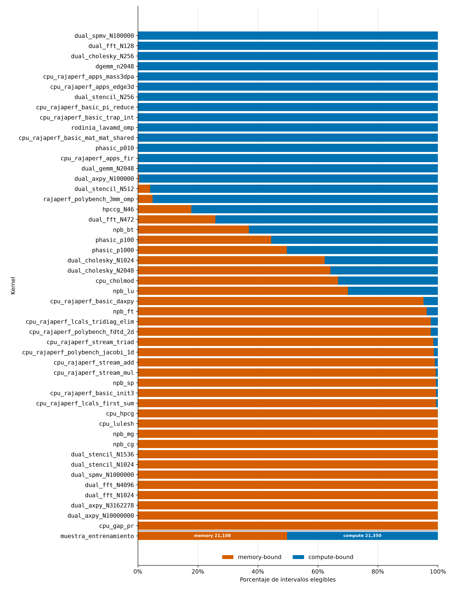

Porcentaje de intervalos elegibles clasificados *compute_bound* y *memory_bound* para cada configuración de
kernel de la campaña CPU. La barra final resume la muestra usada por el clasificador, con 21 350 intervalos
*compute_bound* y 21 108 *memory_bound*.

### 6.2 Flujo de intervalos

Campaña de 49 configuraciones de kernel, diez niveles de frecuencia y 1470 corridas aceptadas de 1470.

| Etapa | Intervalos | Proporción |
|---|---:|---:|
| Procesados | 1 424 531 | 100.0 % |
| Rechazados por frecuencia no utilizable | 71 658 | 5.0 % |
| Rechazados por ventana de origen no válida | 43 118 | 3.0 % |
| **Elegibles** | **1 309 755** | **91.9 %** |
| Elegibles *compute_bound* | 526 279 | 40.2 % de los elegibles |
| Elegibles *memory_bound* | 783 476 | 59.8 % de los elegibles |
| Muestra de ajuste, $\sum\min(n_{fc},1000)$ | 42 458 | |
| Muestra de ajuste *compute_bound* | 21 350 | |
| Muestra de ajuste *memory_bound* | 21 108 | |

### 6.3 Sensibilidad al tope de intervalos por celda

El valor con tope de 1000 proviene de la corrida de sensibilidad y no de la evaluación final (0.728).

| Tope por celda | Intervalos de ajuste | Exactitud balanceada |
|---:|---:|---:|
| 100 | 4 728 | 0.732 |
| 300 | 13 430 | 0.729 |
| 1000 | 42 458 | 0.723 |
| 3000 | 122 135 | 0.739 |
| 10 000 | 355 228 | 0.737 |
| 30 000 | 730 974 | 0.720 |

### 6.4 Variantes del vector de entrada

Mismo modelo y mismo protocolo. La diferencia se calcula frente al vector de seis variables.

| Vector de entrada | Exactitud balanceada | F1 macro | Diferencia (IC95) |
|---|---:|---:|---|
| 6 variables (configuración final) | 0.728 | 0.760 | referencia |
| 12 variables (seis transformaciones adicionales) | 0.724 | 0.783 | −0.004 (−0.026 a +0.011) |
| 6 variables sin frecuencia | 0.720 | 0.752 | −0.008 (−0.018 a +0.001) |
| Solo frecuencia observada | 0.592 | 0.504 | −0.136 (−0.208 a −0.065) |

### 6.5 Esquema de partición

Mismo modelo y mismos datos. El ± es la desviación estándar entre las cinco semillas de muestreo.

| Esquema de partición | Qué mide | Exactitud balanceada |
|---|---|---|
| Intervalos repartidos al azar (80/20) | Memorización de la carga | 0.874 ± 0.024 |
| Dejar un kernel fuera (49 pliegues) | Otro tamaño o variante | 0.733 ± 0.016 |
| Dejar una familia fuera (30 pliegues) | Algoritmo nunca visto | **0.728 ± 0.015** |

### 6.6 Métricas completas de los modelos finales

CPU, media de cinco semillas de muestreo, desviación entre semillas e intervalo de confianza del 95 % por
remuestreo de las 30 familias (el de la exactitud balanceada por celda, sobre las cinco semillas; el de la
exactitud balanceada clásica, con una sola semilla). GPU, validación por familia retirada sobre 483 corridas y 16
familias, con la probabilidad promediada entre cinco semillas y el mismo remuestreo por familia.

| Métrica | CPU | Desv. | IC95 familias (CPU) | GPU | IC95 familias (GPU) |
|---|---:|---:|---|---:|---|
| Exactitud | 0.769 | 0.011 | 0.678 a 0.840 | 0.892 | 0.803 a 0.967 |
| Precisión *compute-bound* | 0.712 | 0.016 | | 0.865 | |
| Sensibilidad *compute-bound* | 0.714 | 0.026 | | 0.825 | |
| F1 *compute-bound* | 0.713 | 0.015 | | 0.844 | |
| Precisión *memory-bound* | 0.808 | 0.013 | | 0.906 | |
| Sensibilidad *memory-bound* | 0.806 | 0.017 | | 0.929 | |
| F1 *memory-bound* | 0.807 | 0.010 | | 0.918 | |
| F1 macro agrupada | 0.760 | 0.012 | | 0.881 | |
| Exactitud balanceada clásica | 0.760 | 0.012 | 0.670 a 0.846 | 0.877 | 0.750 a 0.965 |
| AUC-ROC agrupada | 0.842 | 0.008 | | 0.913 | |
| Coeficiente de Matthews | 0.520 | 0.023 | | 0.763 | |
| **Exactitud balanceada por celda** | **0.728** | **0.015** | 0.669 a 0.790 | **0.819** | 0.710 a 0.938 |

### 6.7 Restauración y coordinación del agente

| Prueba | Resultado |
|---|---|
| Proceso de GPU, candado puesto | El reloj vuelve al valor nativo; código de salida 0 |
| Proceso de CPU, frecuencia modificada | Turbo y rango de frecuencia idénticos al estado inicial; código de salida 0 |
| Ambos procesos a la vez | Ambos salen con código 0; estado de CPU idéntico al inicial y reloj de GPU liberado |
| Piso de CPU con GPU activa (3.2 GHz) | Respetado en el 99.2 % de las muestras; las restantes (cuatro, de unos 0.24 s) están en los flancos de subida |

### 6.8 Valores p de la política de frecuencia CPU (Figura 3.6)

Valor p de Wilcoxon pareado por nivel, referido desde la Figura 3.6 del libro (*forest plot* de la ganancia de EDP
por nivel y clase). Los límites numéricos de los intervalos de confianza están en `datos/cpu_calidad_30fam/politica/`.

| Nivel | Cómputo (19 kernels) | Memoria (28 kernels) |
|---|---:|---:|
| F0 | 0.008 | 0.938 |
| F1 | < 0.001 | 0.120 |
| F2 | < 0.001 | 0.073 |
| F3 | < 0.001 | 0.018 |
| F4 | < 0.001 | 0.009 |
| F5–F8 | < 0.001 | < 0.001 |

---

## 7. Figuras retiradas del cuerpo del libro

Estas figuras respaldan afirmaciones del capítulo 3, donde se citan como «figura 7.n del material complementario».
Los archivos están en [`figuras/`](figuras/) y los scripts que las generan en [`scripts/`](scripts/). Los datos
que las alimentan están en [`datos/`](datos/README.md).

### 7.1 Composición de fase por nivel de frecuencia en CPU

Se cita en la sección 3.1.2 del libro.

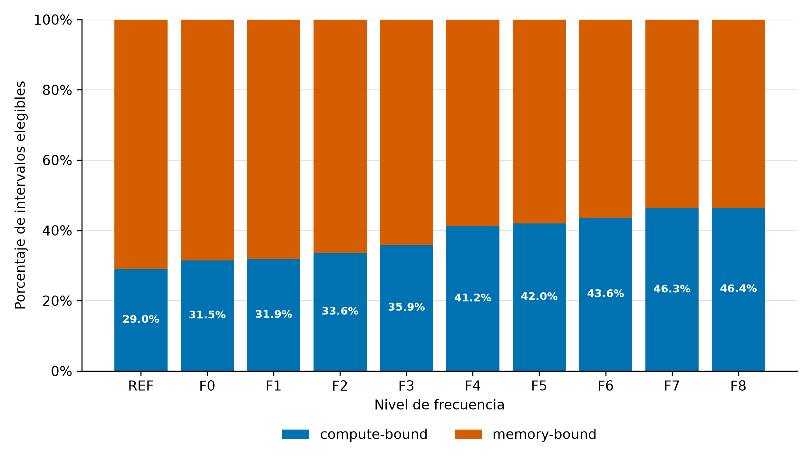

Porcentaje de intervalos elegibles clasificados *compute_bound* y *memory_bound* en cada nivel de frecuencia de la campaña CPU. La proporción de *compute_bound* pasa de 29.0 % en el nivel nativo a 46.4 % en F8.

### 7.2 Muestreo estratificado del conjunto CPU

Se cita en la sección 3.1.4 del libro.

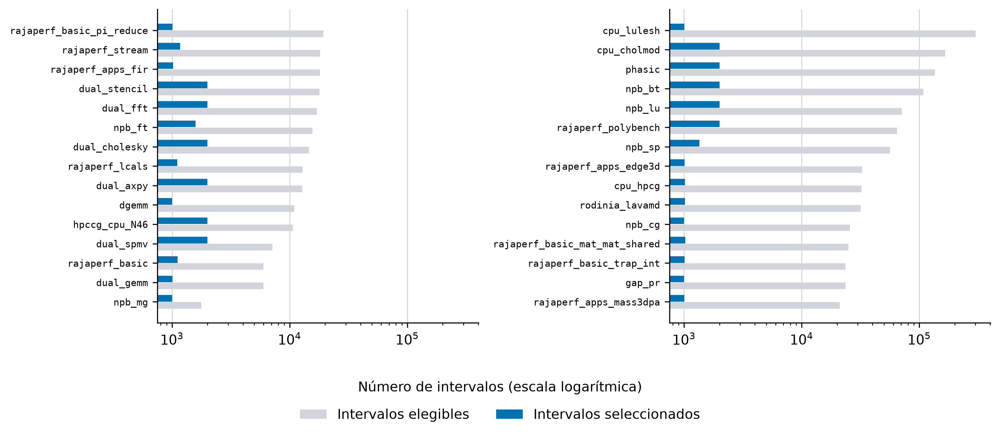

Intervalos elegibles y seleccionados por familia algorítmica. El eje logarítmico permite comparar familias cuyo volumen original difiere en varios órdenes de magnitud.

### 7.3 Correlación entre las variables candidatas del clasificador CPU

Se cita en la sección 3.1.4 del libro.

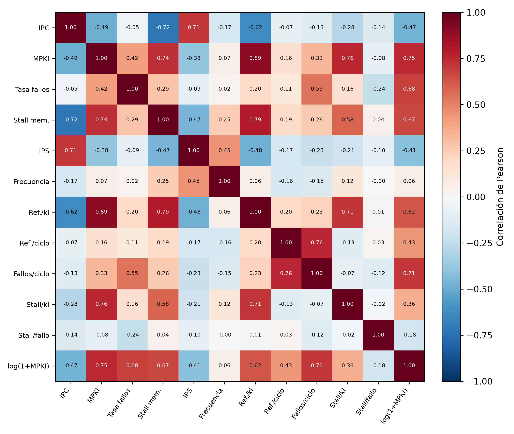

Correlación de Pearson entre las doce columnas candidatas, sobre los 1 309 755 intervalos elegibles, calculada antes de la selección del vector final de seis variables.

### 7.4 Exactitud y cobertura del clasificador CPU por nivel de frecuencia

Se cita en la sección 3.1.4 del libro.

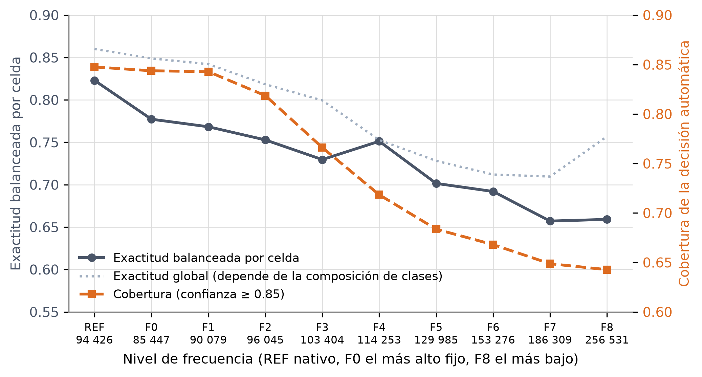

Exactitud balanceada por celda y cobertura de la decisión automática (confianza ≥ 0.85) en función del nivel de frecuencia, con el número de intervalos evaluados de cada nivel bajo su rótulo. La línea punteada es la exactitud global, que depende de la composición de clases de cada nivel. Ambas caen de forma conjunta al bajar el reloj.

### 7.5 Exactitud según la distancia al ridge

Se cita en la sección 3.1.4 del libro.

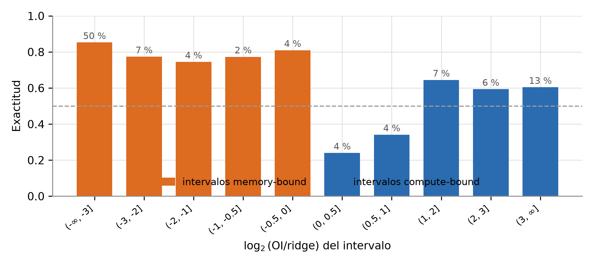

Exactitud del modelo final por franja de log₂(OI/ridge). El porcentaje sobre cada barra indica qué fracción de los intervalos cae en esa franja. Las franjas negativas corresponden a intervalos *memory_bound* y las positivas a *compute_bound*.

### 7.6 Curva de aprendizaje por número de familias

Se cita en la sección 3.1.4 del libro.

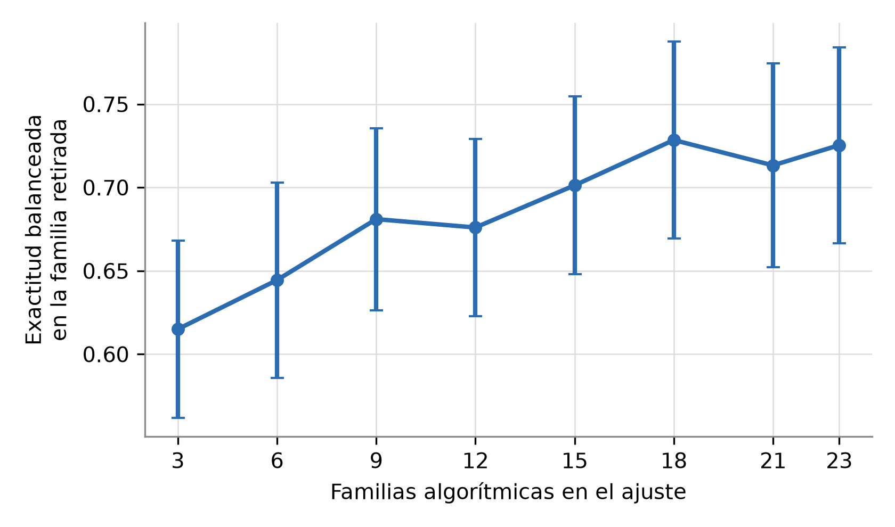

Exactitud balanceada sobre la familia retirada en función del número de familias empleadas en el ajuste. Cada punto promedia las 30 familias retiradas y tres repeticiones de la selección; las barras indican el intervalo de confianza del 95 % entre familias.

### 7.7 Energía, tiempo y producto energía–retardo por nivel de frecuencia en CPU

Se cita en la sección 3.1.6 del libro. Desde la revisión del 2026-09-30 también está en el Anexo A del libro.

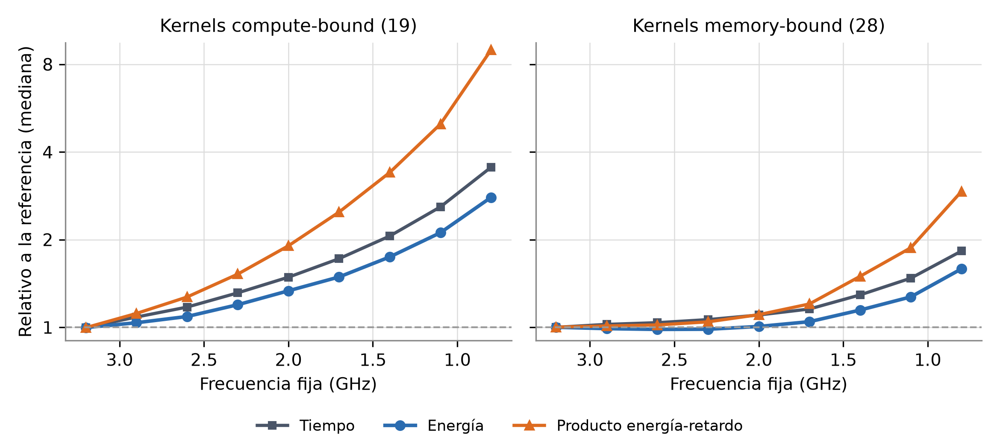

Mediana entre kernels de la energía (paquete y DRAM), el tiempo y el producto energía–retardo de cada nivel fijo, relativos a la referencia nativa, para las dos clases. El eje vertical es logarítmico.

### 7.8 Resultado del random forest de GPU por familia

Se cita en la sección 3.2.3 del libro.

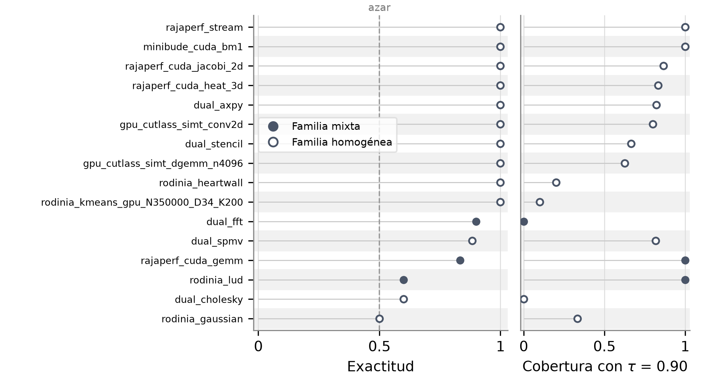

Exactitud y cobertura de la decisión automática (confianza ≥ 0.90) del *random forest* desplegado para cada familia retirada, ordenadas por exactitud. El marcador lleno indica las familias con ambas clases y el hueco las homogéneas; la línea discontinua marca el azar.

### 7.9 Calibración y abstención del random forest de GPU

Se cita en la sección 3.2.3 del libro.

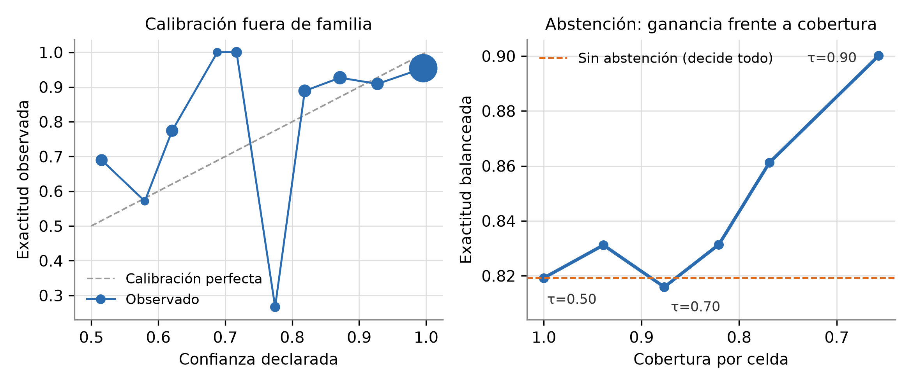

Izquierda, confianza declarada contra exactitud observada, agrupada en diez rangos de igual amplitud; el tamaño de cada punto es proporcional al número de corridas del rango. Derecha, exactitud balanceada por celda contra cobertura para distintos umbrales de decisión τ.

### 7.10 Importancia de las entradas del random forest de GPU

Se cita en la sección 3.2.3 del libro.

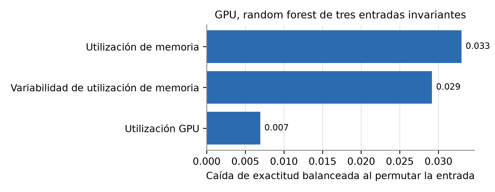

Caída media de exactitud balanceada por celda al permutar cada entrada del *random forest* en la familia retenida. Un valor positivo indica que la entrada contribuye a la predicción fuera de familia.

### 7.11 Tiempo, energía y EDP relativos por nivel de frecuencia en GPU

Se cita en la sección 3.2.4 del libro. Desde la revisión del 2026-09-30 también está en el Anexo A del libro.

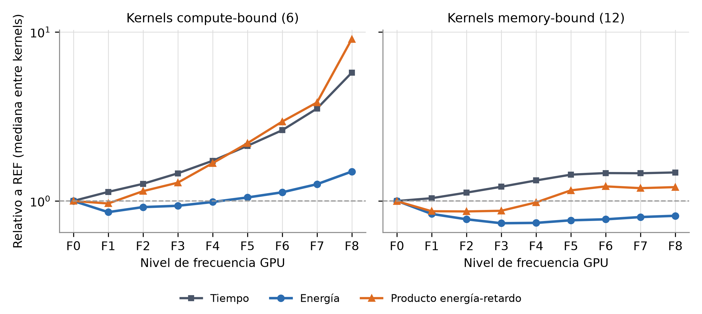

Mediana entre kernels del tiempo, la energía y el producto energía–retardo de cada nivel, relativos a la base, para las dos clases (5 y 9 kernels con corridas en la base, kernel como unidad, descriptivo). El eje vertical es logarítmico.

### 7.12 Potencia de GPU frente al reloj SM y piso estático

Se cita en la sección 3.2.4 del libro. Desde la revisión del 2026-09-30 también está en el Anexo A del libro.

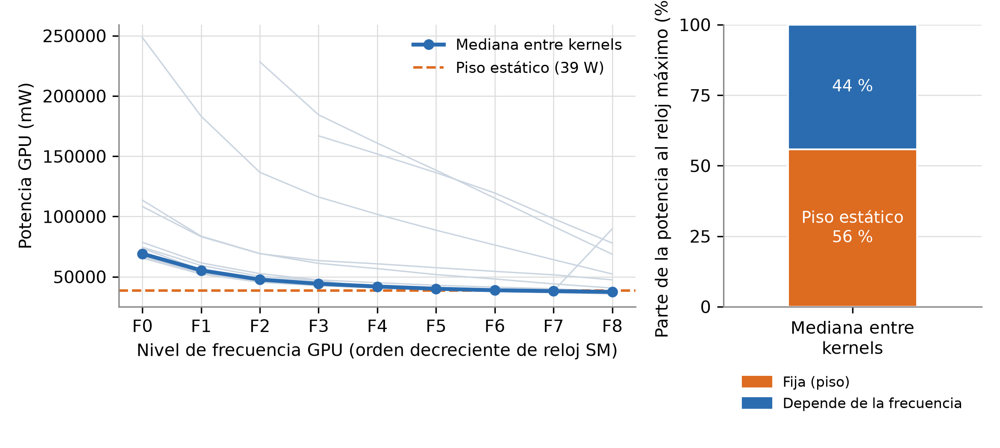

Izquierda, potencia media de GPU de cada kernel (líneas grises) y su mediana en cada nivel, con el piso estático ajustado (12 kernels con ajuste identificable). Derecha, mediana entre esos kernels de la parte de la potencia al reloj más alto que es fija (piso) y la que depende de la frecuencia.
