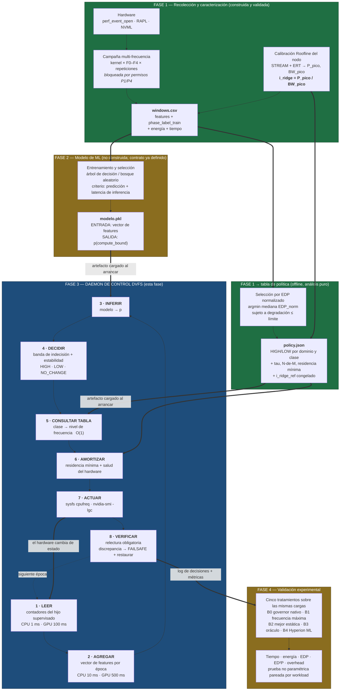

# Plan de implementación — Fase 3: daemon de control DVFS en espacio de usuario

**Proyecto:** Hyperion — agente en espacio de usuario para gestión dinámica de frecuencia en sistemas heterogéneos CPU–GPU
**Nodo objetivo:** `paccaA100` (Intel Xeon Gold 5317, Ice Lake-SP, 12 cores/socket; NVIDIA A100-PCIe-40GB)
**Fecha:** 18 de agosto de 2026
**Rama:** `advisorIntel`
**Objetivo específico que cumple:** el tercero del plan de trabajo de grado — *desarrollar un servicio de control (daemon) en espacio de usuario que lea el estado de los contadores de hardware, ejecute la inferencia del modelo clasificador y aplique políticas proactivas de DVFS a través de las interfaces estándar del sistema operativo*.

Este documento es autocontenido. Toda condición, restricción o decisión previa que lo afecte está escrita aquí, en el lugar donde importa, con su justificación —  no como una referencia cruzada que obligue a abrir otro archivo.

---

## 1. Qué construye esta fase, y la restricción que le da forma

### 1.1 El punto de partida

Al entrar a la Fase 3 el proyecto ya tiene tres cosas construidas y verificadas en hardware real:

- **Un harness de telemetría en C++17** que lanza un binario objetivo como proceso hijo y le adjunta contadores de hardware por `perf_event_open`, produciendo una muestra cada milisegundo con instrucciones, ciclos, referencias y fallos de caché, ciclos de estancamiento de backend, operaciones de punto flotante medidas directamente por PMU, energía de CPU por RAPL y telemetría de GPU por NVML.
- **Un orquestador en Python** que convierte esas muestras crudas en ventanas de análisis con métricas derivadas (`ipc`, `mpki`, `llc_miss_rate`, `stall_backend_ratio`, `operational_intensity`) y que ya sabe aplicar, verificar por relectura y restaurar la frecuencia de CPU y el reloj de GPU.
- **Una calibración Roofline por nodo** que produce el *ridge point* — el cociente entre el cómputo pico y el ancho de banda pico medidos en esa misma máquina — contra el cual se decide si una ventana está limitada por cómputo o por memoria.

Lo que **no** existe todavía es el lazo cerrado. Hoy la frecuencia se fija una vez, antes de correr un binario, y no se toca hasta que termina. El daemon es la pieza que convierte esa medición pasiva en control activo: observar, inferir el régimen, y ajustar la frecuencia mientras la aplicación corre.

### 1.2 La restricción que decide la arquitectura completa

Antes de diseñar nada hay que resolver una pregunta que parece de detalle y no lo es: **¿de dónde lee el daemon los contadores de una aplicación que él no lanzó?**

La respuesta intuitiva sería abrir contadores en modo *system-wide* — es decir, contar todo lo que ocurre en un núcleo físico sin importar qué proceso lo esté usando. En términos del syscall, eso es `perf_event_open(attr, pid = -1, cpu = N, ...)`.

**En `paccaA100` eso está bloqueado.** El nodo tiene `perf_event_paranoid = 2`, el valor más restrictivo de los que se encuentran habitualmente, y bajo ese ajuste el kernel de Linux prohíbe abrir eventos de alcance de CPU completa a un usuario sin privilegios. No es una suposición: se probó directamente sobre los PMU de uncore del nodo y el syscall devuelve `EACCES` (errno 13); una segunda vía independiente (LIKWID con su daemon de acceso a MSR) falla por la misma razón. Bajar `perf_event_paranoid` a `0` o `−1`, o conceder `CAP_PERFMON`, es una de las solicitudes formales de permiso que el proyecto tiene abiertas ante la administración del clúster, y **no ha sido otorgada**.

Lo que **sí** funciona hoy, sin ningún permiso adicional y verificado con campañas completas, es abrir contadores sobre **un PID propio y sus descendientes** (`pid = <hijo>`, `inherit = 1`). Es exactamente el mecanismo con el que se recolectaron las más de un millón de ventanas del dataset actual.

De ahí sale la decisión arquitectónica más importante de esta fase:

> **El daemon opera en modo de lanzamiento supervisado.** No es un servicio que se despierte y observe un sistema arbitrario: es un supervisor que **lanza la aplicación objetivo como proceso hijo**, hereda visibilidad completa sobre ella y sus descendientes, y controla la frecuencia de los núcleos que le fueron delegados mientras esa aplicación vive.

Esta decisión no es una limitación disfrazada de virtud, y conviene defenderla con precisión porque un jurado la va a cuestionar:

1. **Es legítima como agente en espacio de usuario.** El plan aprobado pide un servicio en segundo plano que monitoree el hardware y aplique DVFS por las interfaces estándar del sistema operativo. No pide un servicio system-wide ni un reemplazo del governor del kernel — de hecho excluye explícitamente cualquier intervención en kernel-space.
2. **Es el modelo que usan las herramientas de referencia del área.** `perf stat ./app`, `nvidia-smi dmon`, VTune e Intel Advisor operan todos bajo el mismo patrón de lanzamiento supervisado. Es la forma normal de instrumentar una aplicación en HPC, donde el trabajo llega como un *job* que alguien lanza, no como un proceso que aparece de la nada.
3. **Encaja con cómo se ejecuta realmente el trabajo en este clúster.** La aplicación se lanza dentro de un `srun`; que la lance el daemon en vez del script del usuario es un cambio de una línea en el comando.
4. **Elimina un problema difícil que no aporta nada científicamente:** atribuir contadores a la aplicación correcta cuando hay varias corriendo. Con lanzamiento supervisado la atribución es exacta por construcción.
5. **Deja la puerta abierta.** El componente que lee los contadores se diseña con el alcance como parámetro (`pid` o `cpu`), de modo que si algún día llega el permiso de `perf_event_paranoid`, habilitar el modo system-wide es cambiar un argumento, no reescribir el daemon.

Todo lo que sigue —el ciclo de decisión, el flujo de ejecución, las variables— se deriva de esta forma.

### 1.3 La política que el daemon implementa

El daemon no inventa su política; la ejecuta. La política ya está definida y consolidada, y consta de tres piezas que hay que tener presentes para entender el resto del documento:

- **El modelo dice qué régimen.** Un clasificador ligero (árbol de decisión o bosque aleatorio) recibe un vector de métricas microarquitectónicas y devuelve `compute_bound` o `memory_bound`, con su probabilidad asociada.
- **Una tabla dice qué frecuencia.** Dos estados lógicos por dominio, `HIGH` y `LOW`, cuyos valores concretos se seleccionan experimentalmente minimizando el Producto Energía–Retardo bajo una restricción de degradación de rendimiento. La tabla se consulta en tiempo constante; no hay optimización en línea.
- **Una máquina de estados dice si conviene actuar.** Estabilidad temporal de la predicción, banda de indecisión, residencia mínima en el estado actual, verificación de salud del hardware, y relectura obligatoria de lo aplicado.

Y una corrección importante que atraviesa todo el diseño: **la etiqueta que cierra el lazo de control se calcula contra un *ridge point* de referencia congelado**, no contra el ridge del estado de frecuencia actual. La razón es que el ridge es el cociente entre cómputo pico y ancho de banda pico, y el cómputo pico escala con el reloj mientras el ancho de banda de memoria casi no lo hace. Si se usara el ridge del estado actual, bajar la frecuencia bajaría el ridge, lo que empujaría a la misma carga —sin que la carga cambiara en nada— hacia el lado `compute_bound`, lo que subiría la frecuencia, lo que subiría el ridge, y así indefinidamente. Es un ciclo límite determinista, no ruido; la histéresis no lo elimina, solo alarga su periodo. Anclar la etiqueta a un ridge fijo rompe el lazo y devuelve a la etiqueta su significado correcto: una propiedad de la carga, no del actuador.

---

## 2. Lógica interna del daemon: el ciclo de decisión

### 2.1 Por qué el ciclo tiene dos ritmos y no uno

La tentación natural es un único bucle: leer, inferir, actuar, repetir. Es incorrecto para este proyecto, por una razón física.

El muestreo de CPU ocurre cada **1 ms**. Ese valor está justificado con un barrido experimental propio: es el punto donde la varianza del muestreo se estabiliza sin que el conteo de eventos por ventana caiga a niveles estadísticamente inútiles. Pero **cambiar la frecuencia cuesta más que eso**. La documentación del propio proyecto sitúa el costo de una transición de P-state en el orden de los 10 ms sin control de estados de rendimiento por hardware, y alrededor de 1 ms con él; la literatura de referencia mide entre 0,30 y 0,60 ms para GPUs de varios fabricantes, y trabajos más recientes muestran que en GPUs modernas la latencia efectiva depende del par origen–destino y puede alcanzar decenas de milisegundos.

Si el daemon decidiera cada milisegundo, en el peor caso pasaría más tiempo transicionando que ejecutando a la frecuencia elegida, y el ahorro energético se lo comería el propio mecanismo de ahorro. El Linux `schedutil` reconoce el mismo problema y lo resuelve con un `rate_limit_us` que por defecto se deriva de la latencia de transición del driver.

Por eso el daemon separa dos ritmos:

```
ritmo de OBSERVACIÓN   1 ms   (CPU, perf_event_open)        <- resolución de la señal
                     100 ms   (GPU, NVML)                   <- cadencia real de actualización de NVML
ritmo de DECISIÓN     10 ms   (CPU, agrega 10 ventanas)     <- ~1 orden por encima del costo de transición
                     500 ms   (GPU, agrega 5 muestras NVML) <- ~1 orden por encima de la cadencia de la señal
```

La cadencia de GPU merece una nota aparte: NVML no es una fuente de alta frecuencia. Sus contadores de utilización y potencia son valores filtrados que se refrescan en el orden de decenas de milisegundos, y consultarlos con más frecuencia no produce información nueva, solo costo. Este proyecto ya midió ese efecto y fijó 100 ms como valor operativo, y ya movió el muestreo de NVML fuera del tick de 1 ms del colector precisamente por eso.

### 2.2 Anatomía de una época de decisión

La unidad de trabajo del daemon es la **época de decisión**. Cada época hace exactamente lo mismo, en el mismo orden, y termina siempre con una decisión registrada — incluso cuando la decisión es no hacer nada. Que *toda* época produzca un registro es deliberado: el log completo de decisiones es la evidencia de interpretabilidad que se defiende en la sustentación, y es lo que permite reconstruir a posteriori por qué el agente hizo lo que hizo sin volver a ejecutarlo.

```
┌─ ÉPOCA DE DECISIÓN (dominio CPU: cada 10 ms · dominio GPU: cada 500 ms) ────┐
│                                                                            │
│  1. AGREGAR      Consumir las ventanas acumuladas desde la época anterior  │
│                  y construir un único vector de features agregado.         │
│                                                                            │
│  2. VALIDAR      ¿La telemetría de esta época es utilizable?               │
│                  Si no -> NO_CHANGE, con el motivo. Nunca se infiere       │
│                  sobre datos degradados.                                   │
│                                                                            │
│  3. PRECEDER     ¿Aplica alguna regla que manda sobre el modelo?           │
│                  (hardware insano -> FAILSAFE; GPU ocupada -> piso de CPU) │
│                  Estas reglas se evalúan ANTES de la inferencia, no        │
│                  después: si aplican, el modelo no se consulta.            │
│                                                                            │
│  4. INFERIR      classifier.predict_proba(vector) -> p                     │
│                  p es la probabilidad de compute_bound.                    │
│                                                                            │
│  5. DECIDIR      Banda de indecisión sobre p:                              │
│                    p >= 0.5 + tau  -> candidato HIGH                       │
│                    p <= 0.5 - tau  -> candidato LOW                        │
│                    en otro caso    -> NO_CHANGE (carga mixta o duda)       │
│                                                                            │
│  6. ESTABILIZAR  ¿El candidato se repite N de las últimas M épocas?        │
│                  Si no -> NO_CHANGE.                                       │
│                                                                            │
│  7. CONSULTAR    target = policy[dominio][candidato]  (tabla, O(1))        │
│                  ¿target == estado actual? -> NO_CHANGE.                   │
│                                                                            │
│  8. AMORTIZAR    ¿Se cumplió la residencia mínima en el estado actual?     │
│                  Si no -> NO_CHANGE. Esta es la barrera que impide que     │
│                  el costo de transición se coma el ahorro.                 │
│                                                                            │
│  9. APLICAR      Escribir la frecuencia por la interfaz del sistema.       │
│                                                                            │
│ 10. VERIFICAR    RELEER lo aplicado desde el hardware. Si no coincide con  │
│                  lo pedido -> restaurar el estado original y FAILSAFE.     │
│                  Nunca se asume éxito porque la llamada no falló.          │
│                                                                            │
│ 11. REGISTRAR    Una línea de auditoría con: época, dominio, p, candidato, │
│                  target, observado, motivo, residencia restante.           │
└────────────────────────────────────────────────────────────────────────────┘
```

Los pasos 2, 3, 6, 8 y 10 son todos filtros que pueden terminar la época sin actuar. Esa asimetría es intencional: **el daemon está diseñado para que no actuar sea barato y actuar sea caro de justificar**. En un sistema donde cada actuación cuesta tiempo y energía reales, y donde el hardware es compartido con otros usuarios, esa es la asimetría correcta.

### 2.3 Por qué esta estructura y no otra

Vale la pena decir explícitamente qué alternativas se descartaron y por qué, porque la estructura de arriba parece elaborada hasta que se ven las que no funcionan.

**Un controlador reactivo simple (medir utilización, subir si está alto).** Es lo que ya hacen `ondemand` y `schedutil`, y es precisamente el baseline contra el que hay que demostrar mejora. Un núcleo saturado esperando datos de DRAM y un núcleo saturado haciendo multiplicaciones se ven idénticos desde la utilización; solo se distinguen desde la microarquitectura. Ese es el aporte del trabajo, y desaparecería si el daemon decidiera por utilización.

**Probar frecuencias en tiempo de ejecución para ver cuál da mejor EDP.** No funciona porque el EDP de una ventana ejecutada a una frecuencia no dice cuál habría sido el EDP simultáneo de esa misma ventana a otra frecuencia — la ventana ya pasó. Descubrirlo exigiría explorar, lo que contamina la aplicación que se está midiendo y multiplica las transiciones. Por eso el proyecto separa: la búsqueda de la mejor frecuencia por clase se hace **offline**, en una campaña de caracterización; en línea solo se consulta el resultado.

**Decidir por kernel identificado.** Requeriría saber qué rutina está corriendo (instrumentación, inyección en el binario, o una tabla nombre→frecuencia). Además de ser frágil, no generaliza: una tabla de kernels conocidos no sabe qué hacer con una aplicación que no estaba en el catálogo de entrenamiento, y el objetivo del trabajo es un agente que funcione sobre aplicaciones científicas en general. La clasificación por ventana, en cambio, no necesita saber qué aplicación corre.

---

## 3. Flujo de ejecución: del arranque a la terminación

Aquí se describe la vida completa del proceso. La sección anterior explicó qué pasa en una época; esta explica qué rodea a esas épocas, que es donde vive la seguridad del sistema.

### 3.1 Los siete estados del daemon

```
                    ┌──────────────┐
                    │  ARRANQUE    │  lee configuración y artefactos
                    └──────┬───────┘
                           │
                    ┌──────▼───────┐
                    │  PREFLIGHT   │  verificaciones de solo lectura
                    └──────┬───────┘
                    falla  │  ok
              ┌────────────┴──────────┐
              ▼                       ▼
     ┌─────────────────┐      ┌──────────────┐
     │ ABORTO LIMPIO   │      │  ARMADO      │  snapshot del estado original
     │ (nada tocado)   │      └──────┬───────┘  + handlers de emergencia
     └─────────────────┘             │
                                     ▼
                              ┌──────────────┐
                              │  SUPERVISIÓN │  lanza el hijo; corre épocas
                              └──┬───────┬───┘
                     hijo termina│       │anomalía / señal
                                 │       ▼
                                 │  ┌──────────────┐
                                 │  │  FAILSAFE    │  deja de actuar,
                                 │  └──────┬───────┘  frecuencia al estado seguro
                                 │         │
                                 ▼         ▼
                              ┌──────────────────┐
                              │  RESTAURACIÓN    │  idempotente, siempre
                              └────────┬─────────┘
                                       ▼
                              ┌──────────────────┐
                              │  CIERRE          │  vuelca logs y resumen
                              └──────────────────┘
```

### 3.2 Qué ocurre en cada estado

**ARRANQUE.** El daemon carga tres artefactos y falla ruidosamente si falta alguno: el modelo serializado del clasificador, el archivo de política con la tabla de frecuencias y los umbrales, y el perfil de calibración del nodo del que sale el *ridge point* de referencia. Verifica que la suma de verificación registrada en la política coincida con la del archivo de calibración: si la política fue calibrada contra otro Roofline, sus números no significan lo que dicen, y arrancar sería peor que no arrancar. En este punto no se ha escrito nada en el sistema.

**PREFLIGHT.** Solo lecturas. Se comprueba que los núcleos delegados existen y pertenecen a un único nodo NUMA; que el dominio real de control de frecuencia del hardware está contenido dentro de los núcleos delegados; que el `governor` y los límites de frecuencia son escribibles por este usuario; que RAPL es legible; que NVML responde; que no hay procesos ajenos ocupando los núcleos delegados; y que el estado térmico de partida es normal. Cualquier fallo bloqueante termina en **ABORTO LIMPIO** — que es un estado con nombre propio porque es importante: el daemon puede negarse a arrancar sin haber modificado absolutamente nada del nodo.

La verificación del dominio de frecuencia merece énfasis. En muchos procesadores la frecuencia no se controla por núcleo sino por grupos de núcleos, y en algunos por socket completo. Si el dominio real excede los núcleos delegados, entonces bajar la frecuencia de "mis" núcleos bajaría también la de núcleos que están corriendo el trabajo de otra persona. **`paccaA100` es un clúster compartido**, así que esta verificación es bloqueante sin excepción: el daemon lee `freqdomain_cpus`, `related_cpus` y `affected_cpus` del sysfs y se niega a arrancar si el dominio no está contenido en lo delegado.

**ARMADO.** Se toma una fotografía completa del estado de frecuencia original de cada núcleo delegado —`scaling_governor`, `scaling_min_freq`, `scaling_max_freq`— y del reloj de GPU. Inmediatamente después, y antes de escribir nada, se registran los manejadores de emergencia que garantizan la restauración: en la salida normal del proceso, en `SIGINT` y en `SIGTERM`. El orden importa: primero se sabe cómo volver atrás, después se avanza.

**SUPERVISIÓN.** El daemon lanza la aplicación objetivo como proceso hijo y abre los contadores sobre ese PID con herencia activada, de modo que los hilos y procesos que la aplicación cree queden cubiertos por los mismos contadores. A partir de ahí ejecuta épocas de decisión hasta que el hijo termina. Internamente conviven dos ciclos con cadencias distintas —uno de CPU cada 10 ms y uno de GPU cada 500 ms— que deciden cada uno sobre su propio actuador y no negocian entre sí. La única comunicación entre ellos es una señal unidireccional que se explica en la sección 6.5.

**FAILSAFE.** Se entra aquí por tres caminos: la relectura de una frecuencia aplicada no coincidió con lo pedido; una verificación de salud del hardware falló (temperatura fuera de rango, indicación de *throttling*, un núcleo delegado desaparecido); o llegó una señal de terminación. En FAILSAFE el daemon **deja de actuar por completo** — no reintenta, no ajusta, no "corrige" — restaura la frecuencia al estado original y registra la causa. La decisión de no reintentar es deliberada: un actuador que no responde como se le pide es un actuador que no se entiende, y seguir escribiéndole en un nodo compartido es exactamente lo que no se debe hacer.

**RESTAURACIÓN.** Devuelve cada núcleo delegado a su `governor` y a sus límites originales, y ejecuta el reset del reloj de GPU de forma incondicional. La operación es **idempotente**: ejecutarla dos veces produce el mismo resultado que ejecutarla una, lo cual es indispensable porque puede dispararse simultáneamente desde el flujo normal y desde un manejador de señal. Termina verificando por relectura del sysfs que el estado restaurado es efectivamente el original, y registra el resultado de esa verificación.

**CIERRE.** Vuelca el log de decisiones, un resumen agregado (épocas totales, decisiones por tipo y motivo, número de transiciones, tiempo de residencia acumulado por estado, latencia de inferencia observada) y el código de salida del hijo. El daemon nunca oculta el código de salida de la aplicación que supervisó.

### 3.3 La propiedad que define esta fase

De todo lo anterior, hay una propiedad que debe cumplirse siempre y sobre la que no hay negociación posible:

> **No existe ninguna ruta de ejecución —terminación normal, error interno, excepción no prevista, `SIGINT`, `SIGTERM`, fallo del actuador— que deje al nodo con una frecuencia distinta de la que tenía antes de arrancar el daemon.**

Es una propiedad verificable, y la sección 10 la convierte en un criterio de aceptación concreto. Se verifica con una prueba de caos: interrumpir el daemon a mitad de una corrida real y confirmar **por lectura directa del sysfs** que todo volvió a su estado previo. Esa prueba requiere hardware real y operación humana; no puede darse por cerrada con simulaciones ni con objetos simulados en pruebas unitarias.

---

## 4. Datos de entrada: qué lee el daemon y exactamente de dónde

### 4.1 Contadores de rendimiento de CPU

**Interfaz:** el syscall `perf_event_open(2)`, invocado directamente. No se usa el CLI `perf`, que además no está instalado en `paccaA100`.

**Alcance:** `pid` = el proceso hijo lanzado por el daemon, `cpu = -1`, `inherit = 1`. La herencia es lo que hace que las regiones paralelas OpenMP de la aplicación queden cubiertas sin trabajo adicional. Como se explicó en la sección 1.2, este alcance funciona bajo `perf_event_paranoid = 2`; el alcance por CPU completa no.

**Eventos leídos en cada muestra:**

| Evento | Codificación | Para qué |
|---|---|---|
| Instrucciones retiradas | `PERF_COUNT_HW_INSTRUCTIONS` | Numerador de `ipc`, denominador de `mpki` |
| Ciclos de reloj | `PERF_COUNT_HW_CPU_CYCLES` | Denominador de `ipc` y de la razón de estancamiento |
| Referencias a caché | `PERF_COUNT_HW_CACHE_REFERENCES` | Denominador de la tasa de fallos |
| Fallos de caché | `PERF_COUNT_HW_CACHE_MISSES` | Señal directa de presión de memoria; base del tráfico estimado |
| Estancamientos de backend | `PERF_COUNT_HW_STALLED_CYCLES_BACKEND` | Fracción del pipeline detenida esperando recursos o datos |
| Punto flotante retirado | `FP_ARITH_INST_RETIRED`, evento `0xC7`, sub-eventos escalar/128b/256b/512b de doble precisión | Cómputo real, no estimado |
| Tiempo habilitado / corriendo | campos del propio `read()` de perf | Detección de multiplexación de contadores |

Las cuatro variantes de punto flotante se cuentan por separado y se ponderan por el número de elementos que procesa cada instrucción (1, 2, 4 y 8 respectivamente) para obtener el total de operaciones. Nunca se suman en crudo. Esta medición directa se validó contra el valor analítico conocido de una multiplicación de matrices densas con un error del 0,30 %, y en el nodo se confirmó que los contadores de precisión simple eran cero o ruido irrelevante frente a los de doble precisión, razón por la cual no se añadieron cuatro eventos más que habrían forzado multiplexación.

**Los dos últimos campos son un control de calidad, no un adorno.** El presupuesto de contadores físicos simultáneos de la microarquitectura es limitado; si se piden más eventos de los que caben, el kernel los rota en el tiempo y escala los valores por extrapolación. Cuando `time_running < time_enabled`, los números son estimaciones, y el daemon marca la época como degradada en lugar de inferir sobre ellos.

**Cadencia:** 1 ms. Es el valor que este proyecto justificó con un barrido experimental propio, no un valor heredado: por debajo, el conteo de eventos por ventana cae tanto que las razones derivadas se vuelven inestables; por encima, se empiezan a promediar fases distintas dentro de la misma ventana, que es exactamente lo que el trabajo quiere evitar.

### 4.2 Energía de CPU

**Interfaz:** sysfs de `powercap`, leyendo el contador acumulado de microjulios del dominio de paquete:

```
/sys/class/powercap/intel-rapl/intel-rapl:0/energy_uj
```

y, cuando el nodo lo expone, el dominio de DRAM como subdirectorio del anterior.

**Mecánica:** el archivo contiene un acumulado monótono que se reinicia al desbordar. Se leen valores absolutos y se calculan diferencias entre lecturas consecutivas, con manejo explícito del desbordamiento. El descriptor de archivo se abre una vez y se reutiliza, para no pagar la apertura en cada muestra.

**Cadencia:** la misma de 1 ms del ciclo de muestreo de CPU. La resolución real del contador de RAPL es más gruesa, así que muchas lecturas consecutivas devolverán el mismo valor; eso es correcto y esperado. El agregado por época consume el delta acumulado del intervalo, no el valor instantáneo.

**Estado en el nodo:** RAPL está conectado y verificado en `paccaA100`, con validez energética cercana al 100 % en las campañas ya ejecutadas. No requiere ningún permiso especial.

### 4.3 Telemetría de GPU

**Interfaz:** la biblioteca NVML, enlazada directamente. Las llamadas concretas son:

| Llamada | Qué devuelve | Uso en el daemon |
|---|---|---|
| `nvmlDeviceGetUtilizationRates()` | `.gpu` y `.memory`, en porcentaje | Ambas: una carga con mucho tráfico de memoria y poco uso de SM parece ociosa si solo se mira `.gpu` |
| `nvmlDeviceGetPowerUsage()` | milivatios instantáneos | Feature del modelo; **no** para integrar energía |
| `nvmlDeviceGetClockInfo(NVML_CLOCK_SM)` | MHz del reloj de SM | Verificación por relectura de lo aplicado |
| `nvmlDeviceGetTotalEnergyConsumption()` | milijulios acumulados | Energía de GPU, por diferencias |
| `nvmlDeviceGetTemperature()` | grados Celsius | Verificación de salud del hardware |

**Por qué la energía sale de un acumulado y no de integrar la potencia:** el valor de potencia que reporta NVML es un indicador filtrado y con retardo. Integrarlo a través de fronteras de fase acumula el error del filtro justo donde más importa —en las transiciones, que es donde el daemon actúa—. El contador acumulado de energía es el análogo exacto de RAPL y es la fuente correcta.

**Cadencia:** 100 ms, valor operativo ya fijado y justificado con un barrido propio en este proyecto. Consultar NVML más rápido no produce información nueva porque la fuente misma no se actualiza más rápido.

### 4.4 Estado de frecuencia de CPU

**Interfaz:** sysfs de cpufreq, un directorio por CPU lógica:

```
/sys/devices/system/cpu/cpu<N>/cpufreq/scaling_governor      lectura y escritura
/sys/devices/system/cpu/cpu<N>/cpufreq/scaling_min_freq      lectura y escritura
/sys/devices/system/cpu/cpu<N>/cpufreq/scaling_max_freq      lectura y escritura
/sys/devices/system/cpu/cpu<N>/cpufreq/scaling_setspeed      solo con governor userspace
/sys/devices/system/cpu/cpu<N>/cpufreq/scaling_cur_freq      solo lectura (relectura)
/sys/devices/system/cpu/cpu<N>/cpufreq/freqdomain_cpus       solo lectura (preflight)
```

**Dos estrategias de escritura, seleccionadas automáticamente según el driver detectado.** No es una preferencia estética: son dos mecanismos distintos que exponen dos drivers distintos.

- Con `acpi-cpufreq` se usa `scaling_setspeed` bajo el governor `userspace`. Es control directo y explícito.
- Con `intel_pstate` —que es el caso de `paccaA100`— no existe `scaling_setspeed`. Se fija la frecuencia estrechando el rango: se escriben `scaling_min_freq` y `scaling_max_freq` al mismo valor objetivo, sin tocar el `scaling_governor`. Esto tiene una ventaja de permisos que importa: escribir los dos límites requiere estrictamente menos privilegio que cambiar el governor, y es exactamente lo que la solicitud formal de permiso pide.

Al escribir el rango, el orden de las dos escrituras no es indiferente: escribir primero el límite equivocado puede producir momentáneamente un rango invertido que el kernel rechaza. El código ya resuelve esto eligiendo el orden seguro según si el objetivo está por encima o por debajo del rango actual.

**Relectura:** `scaling_cur_freq` después de cada escritura. Nunca se asume que la escritura funcionó porque no lanzó una excepción.

**Estado en el nodo:** la escritura sobre estos archivos es el permiso `P1` de la solicitud formal, **pendiente de otorgamiento**. Sin él el daemon corre completo en modo observación —lee, infiere, decide y registra qué habría hecho— pero no actúa. La sección 8 explica cómo se aprovecha esa modalidad en lugar de sufrirla.

### 4.5 Control del reloj de GPU

**Interfaz:** `nvidia-smi -i <índice> -lgc <mhz>,<mhz>` para fijar y `nvidia-smi -i <índice> -rgc` para restablecer, con relectura independiente mediante `nvidia-smi --query-gpu=clocks.sm`.

**Por qué esta vía y no otra:** la interfaz de *application clocks* está marcada como obsoleta en el driver de este nodo, de modo que la única ruta de control es el bloqueo de reloj, que requiere privilegios de root. Es el permiso `P4` de la solicitud formal, también **pendiente**.

**Y un hallazgo del propio proyecto que cambia lo que se puede afirmar sobre GPU:** midiendo el reloj de SM *durante* una carga real —no en reposo— la GPU permanece en 765 MHz de los 1410 posibles, usando 62 W de un límite de 250 W, a 26 °C. No hay límite térmico ni energético que lo explique: la GPU simplemente no sube el reloj, y sin el permiso `P4` no hay manera de pedírselo. La consecuencia es que **hoy el espacio de control DVFS de la GPU está colapsado a un único punto**, y por tanto `HIGH` y `LOW` serían el mismo valor. El daemon implementa el dominio de GPU completo, pero mientras esa situación persista el dominio se declara bloqueado en la política, con esta evidencia, en lugar de presentarse como una política operativa.

### 4.6 Del muestreo al vector de features

El clasificador no ve muestras crudas: ve un vector agregado por época. La transformación es exactamente la que ya implementa el post-procesador del orquestador para producir el dataset de entrenamiento, y esa identidad es un requisito, no una coincidencia — si el daemon calculara las features de forma distinta a como se calcularon durante el entrenamiento, el modelo recibiría en producción vectores de una distribución diferente a la que aprendió.

Para cada época:

```
delta_instructions        = instrucciones(fin) - instrucciones(inicio)
delta_cycles              = ciclos(fin) - ciclos(inicio)
delta_cache_references    = referencias(fin) - referencias(inicio)
delta_cache_misses        = fallos(fin) - fallos(inicio)
delta_stalled_backend     = estancamientos(fin) - estancamientos(inicio)

ipc                 = delta_instructions / delta_cycles
mpki                = delta_cache_misses / delta_instructions * 1000
llc_miss_rate       = delta_cache_misses / delta_cache_references
stall_backend_ratio = delta_stalled_backend / delta_cycles
ips                 = delta_instructions / (delta_t_ns / 1e9)

ipc_relative        = ipc / ipc_p95_de_calibración
mpki_relative       = mpki / mpki_p95_de_calibración
miss_rate_relative  = llc_miss_rate / miss_rate_p95_de_calibración
```

Las tres features *relativas* existen por una razón que vale la pena explicar, porque son la diferencia entre un modelo que aprende física y un modelo que memoriza una máquina. Un `ipc` de 1,8 no significa nada por sí solo: significa mucho o poco según de qué procesador se hable. Al normalizar contra el percentil 95 observado en la calibración de referencia del propio nodo, el modelo recibe "qué tan alto es esto **para esta máquina**" en lugar de un número absoluto. Es lo que le da alguna posibilidad de transferirse a otro nodo, y es la razón por la que la calibración de referencia debe correr también al arrancar el daemon, no solo durante la campaña.

**La regla del denominador cero es absoluta.** Cualquier división cuyo denominador sea cero produce un valor no numérico explícito y marca la época con un estado de calidad —nunca un cero silencioso, nunca una excepción no controlada—. Una época así se salta la inferencia y devuelve `NO_CHANGE`. Esta regla es un no-negociable del proyecto y viene de una lección real: los errores silenciosos de datos en este pipeline no se manifiestan como fallos, se manifiestan como resultados plausibles y equivocados.

**Lo que el vector deliberadamente NO incluye: `flops`, `bytes_moved`, `operational_intensity`.** Merece quedar dicho como regla explícita porque no es una omisión, es una condición de diseño con tres razones independientes:

1. **Fuga de la etiqueta.** `phase_label_train` —la etiqueta que supervisa el entrenamiento de Fase 2— se calcula comparando `operational_intensity` contra `i_ridge` (sección 6). Si esa misma intensidad fuera también una *entrada* del modelo, el clasificador no tendría que aprender nada de `ipc`/`mpki`/`stall_backend_ratio`: le bastaría con reproducir la regla de la que salió su propia etiqueta. Un modelo así no sería un clasificador entrenado, sería el umbral de Roofline disfrazado de modelo — y el segundo objetivo específico del plan aprobado pide exactamente lo contrario: inferir el régimen **a partir de la telemetría**, no repetir el cálculo que generó la etiqueta.
2. **Simetría con GPU, que es una restricción dura, no una preferencia de diseño.** En GPU la intensidad operacional **no está disponible en vivo bajo ninguna circunstancia**: medirla requiere `ncu` (Nsight Compute), instrumentación de perfilado invasiva que el diseño de política ya excluyó explícitamente del daemon — se usa una sola vez, offline, en Fase 1, para etiquetar el dataset de entrenamiento, y "nunca vuelve a ejecutarse después de Fase 1, ni en el daemon". El plan aprobado (§5.1) fija además que la única telemetría de GPU en producción es NVML: utilización de multiprocesadores, memoria y potencia — nada de FLOPs ni de bytes. Si el vector de CPU incluyera intensidad operacional mientras el de GPU no pudiera, los dos clasificadores dejarían de seguir la misma metodología, rompiendo la decisión ya tomada de dos clasificadores binarios independientes con el mismo principio de diseño.
3. **Es la razón de ser del modelo.** Si la intensidad operacional estuviera disponible barata y en vivo, no haría falta ningún clasificador: se compararía directo contra `i_ridge_ref` y se acabó — es literalmente la regla de Roofline, sin aprendizaje de por medio. El clasificador existe precisamente para **aproximar esa comparación desde señales más baratas de obtener en tiempo real** — `ipc`, `mpki`, tasa de fallos, ciclos de estancamiento en CPU; utilización y potencia en GPU — que sí se pueden leer en cada época sin el costo, o en GPU sin la imposibilidad práctica, de medir FLOPs y bytes movidos.

`operational_intensity` y `i_ridge` no desaparecen del proyecto: siguen siendo indispensables, pero **solo del lado oracle**, nunca del lado trace. Se usan exactamente dos veces, las dos fuera de la época de decisión del daemon — para calcular `phase_label_train` durante la Fase 1 (con qué se entrena el modelo) y para congelar `i_ridge_ref` en la política (contra qué se decide qué frecuencia corresponde a cada clase, sección 6). El daemon, en cada época, nunca calcula ni necesita conocer la intensidad operacional de lo que está midiendo — solo le pasa el vector de telemetría barata al modelo ya entrenado y lee la probabilidad que devuelve.

**El vector de features en vivo, completo, por dominio:**

```
VECTOR CPU (cada 10 ms, agregado desde muestras de 1 ms):
    ipc, mpki, llc_miss_rate, stall_backend_ratio, ips,
    ipc_relative, mpki_relative, miss_rate_relative

VECTOR GPU (cada 500 ms, agregado desde muestras de 100 ms):
    gpu_util_pct, gpu_mem_util_pct, gpu_power_mw
```

El vector de GPU es deliberadamente más corto que el de CPU, y por la misma razón que motiva toda esta sección: en CPU hay cinco fuentes de conteo por hardware (instrucciones, ciclos, referencias y fallos de caché, estancamientos de backend) que se combinan en cinco razones; en GPU, NVML solo expone utilización y potencia como señal de comportamiento — `gpu_sm_clock_mhz` sirve para verificar por relectura que un cambio se aplicó (no es una entrada del modelo, es una confirmación del actuador) y `gpu_temperature_c` alimenta la verificación de salud del hardware (componente ② de la política, regla de precedencia P-1), no la inferencia. El clasificador de GPU tiene, en consecuencia, menos señal de la que tiene el de CPU — es una limitación real del hardware disponible (NVML es una interfaz más pobre que `perf_event_open` para este propósito) y debe declararse así en el capítulo de resultados si el desempeño del clasificador de GPU resulta más débil que el de CPU.

### 4.7 Reutilización del orquestador: qué evita reconstruir, y qué no

El daemon no arranca de cero. Antes de escribir una sola línea nueva conviene tener claro qué del orquestador ya construido en la Fase 1 se puede **importar tal cual**, qué sirve como **plantilla que hay que adaptar**, y qué es **específico del modo de campaña** y no aplica al daemon en absoluto. Confundir estas tres categorías es la forma más común de perder tiempo reescribiendo algo que ya funciona, o de intentar reutilizar algo que no está hecho para el uso que se le quiere dar.

**Se importa directamente, sin cambios — evita reescribir lógica ya depurada contra hardware real:**

| Módulo / función | Qué evita reconstruir |
|---|---|
| `environment.detect_environment()` | Toda la lógica de sondeo del nodo: parseo de listas de CPU de `freqdomain_cpus`/`related_cpus`/`affected_cpus`, detección de driver (`acpi-cpufreq` vs `intel_pstate`) y de la estrategia de escritura correspondiente, descubrimiento de dominios RAPL, topología NUMA, capacidades de GPU. Este código ya absorbió errores reales de hardware — por ejemplo, el parser de listas de CPU no entendía el formato real de `freqdomain_cpus` (separado por espacios, no por comas) hasta que una corrida real en `felix` lo reveló. Reescribirlo desde cero es reintroducir esa misma clase de error. El preflight del daemon (§3.2) se apoya en esta función sin modificarla. |
| `freqctl.snapshot_original_state()`, `apply_frequency()`, `restore_original_state()`, `install_emergency_handlers()`, `read_observed_frequency_khz()` | **Toda la capa de actuación y seguridad de CPU** (componente ⑧ de la política): las dos estrategias de escritura según driver, la escritura en el orden seguro del rango `min`/`max`, la relectura obligatoria, la restauración idempotente, y los manejadores de `atexit`/`SIGINT`/`SIGTERM` — que `install_emergency_handlers()` ya implementa. La Etapa 2 del plan de construcción (§8) no es "escribir el actuador de CPU": es enlazar este módulo y verificarlo con la prueba de caos. |
| `gpu_freqctl.apply_gpu_frequency()`, `restore_gpu_state()` | El equivalente para GPU: invocación de `nvidia-smi -lgc`/`-rgc`, relectura independiente por `nvidia-smi --query-gpu=clocks.sm` (no por el código de retorno), y el reset incondicional e idempotente. La Etapa 3 (§8) reutiliza esto para la actuación; lo que sí construye de nuevo es la señal `gpu_busy` que decide *cuándo* llamarlo. |
| `calibration.load_calibration()` | Carga y valida el JSON de `roofline_calibration.json`, incluida su suma de verificación. Es exactamente lo que la Etapa 0 (§8) necesita para obtener `i_ridge_ref` al arrancar — sin esto habría que reimplementar el esquema del artefacto y su validación. |
| `node_profile.load_node_profile()` | Carga los percentiles 95 (`ipc_p95`, `mpki_p95`, `miss_rate_p95`) que alimentan las tres features relativas de §4.6. Mismo argumento: el esquema del artefacto y su parseo ya existen y están probados. |
| `telemetry::Collector` (C++, `collector.hpp`) | Esta es la reutilización más grande, y ya viene preparada por diseño para esto: el propio comentario del código dice que "no posee un consumidor y nunca escribe CSV/JSON — el camino caliente está restringido a lecturas de hardware/sysfs, `try_push`" hacia un `SPSCRing` que le pasa quien lo instancia. El daemon **no reimplementa `perf_event_open`, RAPL ni NVML** — instancia `Collector` con la misma configuración que ya usa el harness de campaña (`interval_ns = 1'000'000`, `gpu_interval_ns = 100'000'000`) y le engancha un consumidor propio. Evita meses de trabajo de instrumentación ya validado en `paccaA100` con más de un millón de ventanas reales. |

**Sirven como plantilla, pero necesitan una contraparte "en vivo" — el patrón ya está resuelto, falta adaptar el punto de entrega:**

| Módulo / función | Por qué no se importa tal cual | Qué sí evita |
|---|---|---|
| `postprocess.build_windows()` | Calcula exactamente las fórmulas de §4.6 (`ipc`, `mpki`, `llc_miss_rate`, `stall_backend_ratio`, features relativas), pero como un bloque que opera sobre el `samples.csv` completo de una corrida ya terminada — no expone esas fórmulas como funciones pequeñas invocables ventana por ventana. El daemon necesita el mismo cálculo aplicado a una época que acaba de cerrar, no a un archivo completo. | La parte cara ya está resuelta: **qué fórmula exacta corresponde a cada feature**, incluida la resolución de casos borde (denominador cero → `NaN` + `quality_status`, nunca una excepción). Construir la versión en vivo es trasladar fórmulas ya correctas a un nuevo punto de invocación, no volver a investigarlas. El criterio de aceptación #6 del plan (§10) exige que ambas coincidan dentro de 1e-9 — es la prueba de que la adaptación no introdujo una desviación. |
| `telemetry_kernel_launcher.cpp::drain_samples()` | Es el hilo consumidor que hoy vacía el `SPSCRing` de `Collector` — pero solo para acumular las muestras en un `std::vector` en memoria y volcarlas a `samples.csv` al final de la corrida (patrón de lote). El daemon necesita que, en lugar de acumular, cada muestra alimente la agregación por época y dispare la política cuando la época cierra. | El patrón de *draining* correcto del anillo — fijar afinidad del hilo consumidor, hacer `try_pop()` en bucle mientras no se pida detener, y **drenar lo que quede en el anillo después de la señal de parada** (la segunda pasada de `try_pop()` tras el `while(!stop.load())`, que existe precisamente para no perder las últimas muestras producidas antes de que el productor se detenga) — es una sutileza ya resuelta que un consumidor nuevo escrito desde cero fácilmente pasaría por alto. |

**No aplican al daemon — son específicos del modo de campaña por lotes, y adaptarlos costaría más que escribir la pieza nueva:**

- **`runner.py`** orquesta `subprocess.Popen` y **espera a que el proceso termine** antes de post-procesar nada — es el patrón correcto para ejecutar una corrida de campaña con un manifiesto declarativo, pero el daemon necesita actuar *mientras* el hijo corre, no después. Lo único que se conserva de aquí es el patrón de invocación del harness con `--exec` para envolver el binario externo; la espera bloqueante no se reutiliza.
- **`campaign.py`** construye y secuencia una matriz `kernel × frecuencia × repetición` — no tiene ningún papel en un daemon que supervisa una única aplicación una única vez. Es exclusivamente de la Fase 1.
- **`catalog.py`** valida binarios del catálogo de dataset por checksum — relevante solo si el daemon se prueba contra las cargas ya catalogadas (lo cual es útil para las pruebas de la Etapa 1, §8), pero no forma parte de la lógica del daemon en producción: el daemon debe poder supervisar una aplicación científica arbitraria, no solo las del catálogo.

**El efecto neto sobre el plan de construcción (§8):** la Etapa 0 se reduce en la práctica a *enlazar* `environment.py`, `calibration.py` y `node_profile.py`, no a escribir su lógica. La Etapa 2 se reduce a *enlazar* `freqctl.py` y verificarlo con la prueba de caos, no a escribir la máquina de relectura/restauración. Lo que sí exige trabajo nuevo, y es donde debe concentrarse el esfuerzo real de esta fase, es exactamente lo que aparece en la columna central de la segunda tabla: el consumidor en vivo del `SPSCRing` y la versión por-época de las fórmulas de `postprocess.py` — ninguno de los dos es investigación nueva, son adaptaciones de algo ya correcto a un punto de entrega distinto.

---

## 5. Variables de control, parámetros y umbrales

Esta sección lista todo lo que el daemon puede tener configurado, qué significa físicamente, por qué el valor por defecto es razonable **en este hardware y con estas cargas**, y qué se rompe si se pone demasiado alto o demasiado bajo.

### 5.1 La distinción entre variables *oracle* y variables *trace*

Es la distinción más importante para entender el daemon, y conviene enunciarla con precisión:

- **Variable *oracle*:** su valor proviene de conocimiento adquirido **antes** de la ejecución — de la campaña de caracterización, de la calibración del nodo, o del entrenamiento del modelo. Durante la ejecución es **constante y de solo lectura**. Si una variable oracle cambiara en caliente, la política dejaría de ser la que se calibró y validó, y ningún resultado experimental sería atribuible.
- **Variable *trace*:** su valor se **observa del sistema en tiempo real**, época a época. Es la señal viva. El daemon nunca la fija; solo la lee y la interpreta.

La separación no es organizativa sino epistemológica: **las variables oracle son las hipótesis del sistema y las variables trace son la evidencia**. Toda decisión del daemon es una confrontación entre unas y otras. Cuando se dice que la política es interpretable, se está diciendo exactamente esto: cada decisión se puede reconstruir sabiendo qué oracle estaba cargado y qué trace se observó.

### 5.2 Variables *oracle*

| Variable | Significado físico | Defecto | Si es demasiado alta | Si es demasiado baja |
|---|---|---|---|---|
| `i_ridge_ref` | Intensidad operacional, en FLOP por byte, donde se cruzan el techo de cómputo y el techo de memoria del nodo. Frontera entre régimen de cómputo y de memoria. | Medida, no fijada. En la GPU del nodo: **7,28** FLOP/byte para precisión simple y **3,36** para doble, derivadas de 1,399 TB/s de ancho de banda y 10 178 / 4 699 GFLOP/s de pico. El valor de CPU sale de la calibración con STREAM y ERT. | Cargas realmente limitadas por cómputo se clasifican como limitadas por memoria y se les baja la frecuencia: pérdida directa de rendimiento sin ahorro proporcional. | Lo inverso: cargas limitadas por memoria corren a frecuencia alta desperdiciando energía en ciclos de espera. |
| `f_ref_level_id` | Nivel de frecuencia contra el cual se congeló `i_ridge_ref` y contra el cual se normaliza el EDP. | `F0` (máxima) si hay permiso de escritura; la frecuencia nativa del nodo si no. | — | — |
| `HIGH[dominio]`, `LOW[dominio]` | Los dos estados de frecuencia efectivos por dominio. No son "máximo" y "mínimo" por definición: son los que minimizan el EDP mediano bajo restricción de degradación. | **Pendientes de la campaña de caracterización.** Deben quedar en `null` hasta que existan; un valor inventado aquí invalidaría todo resultado posterior. | Si ambos quedan muy juntos, la política no se distingue de una frecuencia fija y el trabajo no puede demostrar valor. | Si quedan muy separados, cada transición cuesta más y el riesgo de degradación de rendimiento crece. |
| `tau` | Media anchura de la banda de indecisión sobre la probabilidad del clasificador. Cuánta confianza se exige antes de aceptar una clase. | **0,15** (es decir, se exige probabilidad ≥ 0,65 o ≤ 0,35). Barrido offline sobre `{0,05 … 0,25}` en el conjunto de validación. | El daemon casi nunca decide y se comporta como frecuencia fija. | Actúa sobre predicciones de baja confianza y aumenta las transiciones inútiles, justo en las cargas mixtas. |
| `n_of_m` | Cuántas de las últimas `M` épocas deben coincidir para aceptar un cambio de clase. Filtro de ruido temporal. | **3 de 4.** Con épocas de CPU de 10 ms, implica una latencia de detección de 30 a 40 ms. | Detección lenta: fases cortas terminan antes de que el daemon reaccione. | Reacciona a ventanas atípicas y conmuta de más. |
| `min_residence_ms` | Tiempo mínimo que una frecuencia aplicada debe permanecer antes de poder cambiar. Es la barrera de amortización del costo de transición. | **100 ms** en CPU (≈10× el costo pesimista de transición de 10 ms citado en el plan aprobado). En GPU, **1000 ms**. Ambos deben recalibrarse contra la latencia de transición **medida** en el nodo el día que lleguen los permisos, no contra valores de literatura. | El daemon se pierde fases legítimas por estar esperando: la adaptabilidad se pierde y converge al mejor estático. | El costo de transición deja de amortizarse y puede anular todo el ahorro energético. |
| `slowdown_limit` | Degradación relativa de tiempo de ejecución máxima aceptable frente a la referencia. Restricción de la selección de la tabla. | **5 %**, con 3 % y 10 % estudiados en el piloto y el valor congelado antes de la campaña final. | La tabla elige frecuencias agresivamente bajas y el agente se vuelve inaceptable para un usuario de HPC. | La tabla no puede alejarse de la referencia y no hay ahorro que demostrar. |
| `delegated_cpus` | Los núcleos físicos sobre los que el daemon tiene autoridad. **Fuera de esta lista no escribe jamás.** | 6 núcleos en `paccaA100`, un hilo por núcleo físico. | Se toca hardware de otros usuarios: inaceptable en un clúster compartido. | Menos paralelismo disponible para la aplicación medida. |
| modelo serializado | El clasificador entrenado. Recibe el vector de features y devuelve la probabilidad de `compute_bound`. | Árbol de decisión o bosque aleatorio, seleccionado en la Fase 2 por el mejor compromiso entre desempeño predictivo y latencia de inferencia. | Un modelo más complejo mejora la predicción pero su latencia de inferencia empieza a competir con la época de 10 ms. | Un modelo trivial no aporta sobre una regla de umbrales y hace redundante el objetivo del trabajo. |

### 5.3 Variables *trace*

| Variable | Significado físico | Fuente exacta | Cadencia |
|---|---|---|---|
| `ipc` | Instrucciones retiradas por ciclo. Cuánto trabajo útil produce el núcleo por unidad de tiempo de reloj. | `perf_event_open` | 1 ms, agregada por época |
| `mpki` | Fallos de caché por cada mil instrucciones. Presión de memoria normalizada por trabajo. | `perf_event_open` | 1 ms, agregada |
| `llc_miss_rate` | Fracción de referencias a caché que no se resuelven en la jerarquía. | `perf_event_open` | 1 ms, agregada |
| `stall_backend_ratio` | Fracción de ciclos en los que el pipeline no avanza esperando recursos o datos. La señal más directa de que el cuello de botella no es aritmético. | `perf_event_open` | 1 ms, agregada |
| `ips` | Instrucciones por segundo. Escala con la frecuencia, a diferencia de `ipc`. | derivada | por época |
| `ipc_relative`, `mpki_relative`, `miss_rate_relative` | Las tres anteriores normalizadas contra el percentil 95 de la calibración de referencia del nodo. | derivadas | por época |
| `running_ratio` | Cociente entre tiempo corriendo y tiempo habilitado de los contadores. Detecta multiplexación. | `perf_event_open` | por época |
| `pkg_delta_uj`, `dram_delta_uj` | Energía consumida en el intervalo, en microjulios. | `/sys/class/powercap/intel-rapl/…/energy_uj` | 1 ms, por diferencias |
| `gpu_util_pct`, `gpu_mem_util_pct` | Utilización de multiprocesadores y de memoria de la GPU. | `nvmlDeviceGetUtilizationRates()` | 100 ms |
| `gpu_power_mw` | Potencia instantánea de GPU. | `nvmlDeviceGetPowerUsage()` | 100 ms |
| `gpu_sm_clock_mhz` | Reloj de SM realmente vigente. Es la relectura que confirma que un cambio se aplicó. | `nvmlDeviceGetClockInfo()` | 100 ms |
| `gpu_energy_mj` | Energía acumulada de GPU. | `nvmlDeviceGetTotalEnergyConsumption()` | 100 ms, por diferencias |
| `gpu_temperature_c` | Temperatura de la GPU. Entrada de la verificación de salud. | `nvmlDeviceGetTemperature()` | 100 ms |
| `freq_khz_observed` | Frecuencia realmente vigente en un núcleo delegado. | `scaling_cur_freq` | tras cada escritura |
| `gpu_busy` | Señal derivada: la GPU está haciendo trabajo activo. | derivada de utilización y potencia de GPU | 500 ms |
| `residence_elapsed_ms` | Tiempo transcurrido desde la última transición aplicada en este dominio. | reloj monótono interno | por época |

Una nota sobre el reloj: todos los tiempos del daemon usan `CLOCK_MONOTONIC`. Un reloj de pared puede saltar hacia atrás por sincronización horaria, y un salto hacia atrás en medio de un cálculo de residencia mínima produciría exactamente el comportamiento que la residencia mínima existe para impedir.

---

## 6. Selección de frecuencia

Esta es la sección donde el trabajo hace su afirmación científica, así que conviene desarrollarla con cuidado.

### 6.1 El mecanismo

Dado un régimen inferido, la selección es una consulta a una tabla de dos entradas por dominio:

```
policy["cpu"]["compute_bound"] -> HIGH -> un nivel de frecuencia concreto
policy["cpu"]["memory_bound"]  -> LOW  -> un nivel de frecuencia concreto
```

El costo de la consulta es constante. No hay optimización, ni búsqueda, ni cálculo de EDP en línea. Toda la inteligencia de la selección está en cómo se llenó esa tabla, que ocurre offline.

### 6.2 Por qué bajar la frecuencia en régimen de memoria mejora el EDP

El argumento es físico y es el corazón del trabajo.

El Producto Energía–Retardo es `EDP = E × T`. La energía es la integral de la potencia en el tiempo, y en un procesador CMOS la potencia tiene una componente dinámica que crece aproximadamente con el cuadrado del voltaje por la frecuencia —y como el voltaje debe subir para sostener frecuencias más altas, la dependencia efectiva de la frecuencia es marcadamente superlineal— más una componente estática que no depende de la frecuencia en absoluto.

Ahora, la pregunta clave: **¿cuánto crece `T` al bajar la frecuencia?** Y la respuesta depende del régimen, que es precisamente lo que el modelo Roofline formaliza:

- **En régimen limitado por cómputo**, el camino crítico son las unidades funcionales del núcleo. Reducir el reloj a la mitad aproximadamente duplica el tiempo. `T` crece de forma prácticamente lineal en el inverso de la frecuencia. La energía baja, pero el tiempo sube casi en la misma proporción, y el producto `E × T` empeora.
- **En régimen limitado por memoria**, el camino crítico es el subsistema de memoria: latencia de DRAM y ancho de banda del controlador, que pertenecen a un dominio de reloj distinto y **no escalan con la frecuencia del núcleo**. Reducir el reloj del núcleo hace que este espere más ciclos por el mismo dato, pero el tiempo de pared casi no cambia porque el tiempo ya lo estaba fijando la memoria. La energía cae de forma superlineal mientras el tiempo apenas se mueve, y el producto `E × T` mejora.

Esta asimetría es exactamente lo que el clasificador está detectando, y es la razón por la que el proyecto invirtió en la calibración Roofline en lugar de usar utilización: **la utilización no distingue estos dos casos y el modelo Roofline sí**. Un núcleo al 100 % esperando DRAM y un núcleo al 100 % multiplicando se ven idénticos desde `top` y radicalmente distintos desde `mpki` y `stall_backend_ratio`.

### 6.3 Por qué la tabla no puede escribirse a mano

Aquí es donde el trabajo se separa de la intuición. La regla obvia sería `compute → frecuencia máxima, memory → frecuencia mínima`. **Es casi seguramente subóptima**, y por una razón concreta.

La componente estática de la potencia y el consumo del uncore y de la memoria no bajan al bajar el reloj del núcleo. Existe entonces un piso de potencia que se paga por unidad de tiempo pase lo que pase. Si se baja la frecuencia lo suficiente, llega un punto en que el alargamiento del tiempo de ejecución hace que ese piso se pague durante más tiempo del que se ahorra en potencia dinámica, y la **energía total vuelve a subir**. Es el fenómeno conocido como *race to idle*: a veces terminar rápido y apagar consume menos que ir despacio.

La consecuencia es que la curva de EDP frente a frecuencia, para una clase dada, **tiene un mínimo interior**, no en un extremo. Dónde está ese mínimo depende del piso de potencia del nodo, del ancho de banda de su memoria y de la carga concreta — no es predecible desde primeros principios y hay que medirlo.

Por eso el procedimiento de llenado de la tabla es experimental:

```
Para cada dominio d, cada clase c y cada nivel de frecuencia f en F0…F4:
  1. Medir energía y tiempo por repetición.  EDP = E × T
  2. Normalizar por workload contra el nivel de referencia:
         EDP_norm(w,d,f) = EDP(w,d,f) / EDP(w,d,F_ref)
     — sin esto, un kernel largo domina la estadística por su magnitud
       absoluta, no por su comportamiento.
  3. Estimar la mediana de EDP_norm entre workloads, con intervalo de
     confianza del 95 % por bootstrap.
  4. Descartar todo nivel cuya degradación máxima observada de tiempo de
     ejecución exceda slowdown_limit.
  5. Elegir  f*(d,c) = argmin_f  mediana_w( EDP_norm(w,d,f) )
     sujeto a la restricción anterior. Ante niveles estadísticamente
     indistinguibles, elegir el de menor degradación (criterio conservador).
```

Un detalle estadístico que importa: con tres repeticiones por celda **no se puede estimar un percentil 95**; el P95 empírico sobre tres observaciones es indistinguible del máximo. Por eso el criterio de degradación usa el **máximo observado** —conservador y honesto— y el intervalo de confianza se construye por bootstrap sobre la mediana **entre workloads**, que sí tiene unidades suficientes (seis o siete kernels).

### 6.4 Qué hace el daemon cuando el régimen es ambiguo

Este caso no es una curiosidad de diseño: está documentado en los datos del proyecto. El kernel `npb_sp` reparte sus ventanas aproximadamente 58 % memoria / 42 % cómputo a frecuencia fija, y `npb_ft` cambia su proporción del 79,7 % al 66,2 % de ventanas de cómputo al aumentar el tamaño del problema. Son cargas genuinamente mixtas, no cargas mal medidas.

Contra una carga así, **una decisión binaria dura conmuta permanentemente por diseño**, y cada conmutación cuesta. La respuesta del daemon es una tercera acción explícita:

```
p >= 0.5 + tau   ->  HIGH
p <= 0.5 - tau   ->  LOW
en otro caso     ->  NO_CHANGE   <- se queda donde está
```

`NO_CHANGE` no es "no sé qué hacer": es **la decisión correcta** para una carga cuyo régimen no está definido a la resolución de la época. Mantener el estado actual evita pagar transiciones por una señal que no las justifica, y el costo de implementarlo es nulo porque los árboles y bosques aleatorios que el plan ya obliga a usar exponen la probabilidad de clase sin cómputo adicional relevante.

Sobre la banda actúa además el filtro de estabilidad `N` de `M`. Los dos mecanismos atacan problemas distintos y son complementarios: **la banda filtra incertidumbre del modelo; el filtro `N` de `M` filtra ruido temporal**. Una carga mixta produce probabilidades cercanas a 0,5 de forma sostenida (la banda la atrapa); una fase real interrumpida por una ventana atípica produce una probabilidad extrema aislada (el filtro la atrapa).

### 6.5 Reglas que mandan sobre el modelo

Hay tres situaciones en las que el daemon **no consulta al clasificador**, porque se sabe de antemano que su respuesta sería incorrecta o irrelevante. Se evalúan antes de la inferencia, en este orden:

**Primera: hardware insano.** Temperatura fuera de rango, indicación de *throttling*, un núcleo delegado que dejó de responder. Se va a `FAILSAFE` y se restaura. No hay caso en que valga la pena seguir actuando sobre hardware que no está en un estado conocido.

**Segunda: la GPU está ocupada — llevar la CPU a su piso, sin preguntarle al modelo.** Esta es la regla más específica del diseño y la que hace que el daemon sea realmente *heterogéneo* en lugar de dos controladores independientes puestos en la misma caja.

Cuando el CPU espera a que la GPU termine, con el comportamiento por defecto de CUDA, el hilo de CPU no se bloquea: ejecuta un bucle de espera activa. Desde los contadores eso se ve como IPC alto y casi cero fallos de caché — es decir, **exactamente el perfil de una carga limitada por cómputo**. Un clasificador correcto y bien entrenado diría `compute_bound` y la política subiría la frecuencia justo cuando el CPU no está haciendo ningún trabajo útil. No es un fallo del modelo: es un caso en que la señal es genuinamente engañosa.

La corrección es forzar el piso de frecuencia de CPU mientras la GPU esté activa, sin consultar al modelo. En el caso alternativo —cuando la espera sí es bloqueante y el hilo sale de la cola de ejecución— el efecto del P-state sobre el consumo es casi nulo, así que forzar el piso no ayuda pero tampoco cuesta; y como muchas implementaciones de espera bloqueante hacen un giro corto antes de bloquearse de verdad, cubrir ese margen es gratis. Por eso la regla se aplica en ambos casos: en uno corrige un error real, en el otro es una defensa sin costo.

Este proyecto ya construyó y verificó en hardware el mecanismo que fuerza la espera bloqueante en binarios de terceros —una biblioteca precargada que interpone la configuración del dispositivo CUDA, con la que el uso de CPU durante la espera pasó del 99,8 % al 0,0 % sin alterar la salida de los kernels—. Pero ese mecanismo solo aplica a las cargas del catálogo; una aplicación arbitraria en producción no lo tiene, y por eso la regla debe vivir en el daemon.

La señal es **unidireccional**: el ciclo de GPU la emite, el de CPU la consume, y el de GPU nunca consulta nada del de CPU. Esto preserva la independencia de los dos ciclos de decisión y evita cualquier negociación entre dominios, que sería otro proyecto.

**Tercera: telemetría inválida.** Época degradada por multiplexación de contadores, denominador cero, o muestras faltantes. Se devuelve `NO_CHANGE`. No se imputa, no se rellena, no se "arregla" el dato.

---

## 7. Cómo se conecta el daemon con el resto del proyecto

El daemon es la pieza que cierra el ciclo entre las cuatro fases. El siguiente diagrama muestra el recorrido completo — recolección, modelo, técnica de DVFS — y qué artefacto concreto viaja de una fase a la siguiente.



**El punto que el diagrama deja ver y que conviene subrayar:** la Fase 2 aparece como una caja con un contrato de entrada y salida perfectamente definido —recibe un vector de features, devuelve una probabilidad— y **nada más del sistema depende de sus detalles internos**. El daemon no sabe ni le importa si dentro hay un árbol de decisión o un bosque aleatorio.

Esa es la razón por la que el daemon **se puede construir y probar entero antes de que el modelo exista**. Basta con implementar el mismo contrato con tres sustitutos:

- un **clasificador de traza**, que reproduce las etiquetas ya calculadas de una campaña anterior — permite validar toda la máquina de estados contra datos reales sin ejecutar nada;
- un **clasificador oráculo**, que devuelve la etiqueta verdadera calculada por el Roofline — permite medir el techo de lo que la política puede lograr si la clasificación fuera perfecta, que es uno de los cinco tratamientos experimentales de la Fase 4;
- un **clasificador de prueba**, que devuelve secuencias fijas — permite ejercitar cada rama de la máquina de estados de forma determinista en pruebas automatizadas.

Cuando el modelo real esté entrenado, se conecta en el mismo punto y nada más cambia. Esta independencia es la decisión de planificación más importante del documento: significa que el objetivo específico tres —construir el daemon— **no está bloqueado** ni por el entrenamiento del modelo ni por los permisos administrativos pendientes.

---

## 8. Construcción por etapas

Las etapas están ordenadas por una regla: **cada una debe terminar en algo ejecutable y verificable, y ninguna puede depender de un permiso administrativo que no se controla.** Todo lo que depende de permisos se concentra al final y se diseña para que su ausencia degrade el alcance, no lo impida.

### Etapa 0 — Contrato y esqueleto

**Se construye:** el proceso que arranca, carga los tres artefactos (modelo, política, calibración), valida sus sumas de verificación, ejecuta el preflight completo de solo lectura, y termina limpiamente. Un clasificador de prueba que devuelve secuencias fijas. El log estructurado de decisiones. **Todavía no escribe ninguna frecuencia.**

**Se puede probar al terminar:** que el daemon se niega a arrancar si falta un artefacto, si la política fue calibrada contra otro Roofline, si los núcleos delegados cruzan nodos NUMA, o si el dominio real de control de frecuencia excede lo delegado. Que en todos esos casos el nodo queda exactamente como estaba.

**Queda pendiente:** todo lo que actúa.

**Por qué esta etapa primero:** porque establece la propiedad que hace seguro todo lo demás — que el daemon puede negarse a arrancar sin haber tocado nada. Construir el actuador antes que la puerta que decide si se abre es el orden que produce accidentes en hardware compartido.

### Etapa 1 — El lazo de observación

**Se construye:** el lanzamiento del proceso hijo, la apertura de contadores sobre ese PID con herencia, la lectura de RAPL y NVML, el agregado por época y la construcción del vector de features. La máquina de estados completa, con todos sus filtros, **decidiendo y registrando pero sin aplicar nada**.

**Se puede probar al terminar:** que las features calculadas en vivo coinciden, dentro de tolerancia numérica, con las que el post-procesador del orquestador produce sobre las mismas muestras crudas. Esta equivalencia es un requisito duro, no una comprobación de conveniencia: si el daemon calculara las features de forma distinta a como se calcularon durante el entrenamiento, el modelo recibiría en producción vectores de una distribución distinta a la que aprendió, y su desempeño real no tendría relación con el validado.

También se puede medir aquí, ya de forma definitiva, el **overhead de observación**: cuánto cuesta leer y agregar, comparando el tiempo de ejecución de la aplicación bajo el daemon contra su tiempo sin él.

**Queda pendiente:** la actuación.

**Por qué después de la etapa 0:** porque necesita los artefactos cargados y validados para saber contra qué `ridge` y con qué umbrales decidir.

**Por qué habilita la siguiente:** al terminar esta etapa el daemon ya produce, en cada época, la decisión completa que *habría* tomado. La etapa siguiente solo tiene que conectar esa decisión a un actuador — y como la decisión ya está registrada y es auditable, cualquier comportamiento inesperado del actuador se puede distinguir de un error de decisión.

### Etapa 2 — Actuación segura sobre CPU

**Se construye:** la escritura de frecuencia sobre los núcleos delegados, con selección automática de estrategia según el driver detectado; la relectura obligatoria; el `FAILSAFE`; la restauración idempotente registrada en la salida normal, en `SIGINT` y en `SIGTERM`.

**Se puede probar al terminar:** la **prueba de caos** — lanzar el daemon sobre una carga real, interrumpirlo abruptamente a mitad de ejecución, y confirmar por lectura directa del sysfs que el `governor` y ambos límites de frecuencia de cada núcleo delegado volvieron a su valor original. Se repite matando el proceso en cada uno de los estados posibles. Esta prueba requiere hardware real con permiso de escritura y operación humana; **no es delegable a un agente de IA ni sustituible por pruebas con objetos simulados**.

También se verifica, auditando el log completo, que **no existe ni una sola escritura fuera de los núcleos delegados**.

**Queda pendiente:** GPU y el modelo real.

**Por qué después de la etapa 1:** porque hasta ahora no había nada que restaurar. El momento de construir las garantías de restauración es exactamente el momento en que aparece la primera escritura, ni antes ni después.

**Nota sobre permisos:** si el permiso de escritura sobre cpufreq no ha llegado, esta etapa se construye igual y se prueba contra un sysfs simulado en un entorno local con privilegios; lo único que espera al permiso es la prueba de caos en el nodo real.

### Etapa 3 — El dominio de GPU

**Se construye:** el segundo ciclo de decisión con su cadencia de 500 ms, la lectura de NVML, la señal unidireccional de GPU ocupada hacia el ciclo de CPU, y el control del reloj de SM con su propia relectura independiente y su reset incondicional.

**Se puede probar al terminar:** que la señal de GPU ocupada efectivamente lleva la CPU a su piso durante una espera de sincronización, comprobado con una carga CUDA real. Que el reset del reloj es idempotente. Que las dos cadencias conviven sin que la de GPU perturbe la de CPU.

**Queda pendiente:** el modelo real y la tabla calibrada.

**Por qué después de la etapa 2:** porque la señal de GPU ocupada actúa **sobre** el actuador de CPU. Construirla antes de que el actuador de CPU exista y sea seguro sería construir sobre un cimiento que aún no está.

**Nota sobre el estado del hardware:** mientras el permiso de control de reloj de GPU no llegue, y dado que la GPU del nodo permanece en 765 MHz de los 1410 posibles incluso bajo carga real, esta etapa se construye y se valida en modo observación. La señal de GPU ocupada —que es la parte que afecta al EDP en cargas heterogéneas— **sí funciona sin ningún permiso**, porque solo requiere leer NVML y escribir la frecuencia de CPU.

### Etapa 4 — Integración del clasificador y medición del overhead de decisión

**Se construye:** la carga del modelo serializado y la inferencia dentro de la época, detrás del mismo contrato que ya usan los clasificadores sustitutos. La instrumentación de la latencia de inferencia, reportada como percentiles y máximo, no como promedio.

**Se puede probar al terminar:** que la latencia de inferencia en el percentil 95 se mantiene por debajo de una fracción pequeña de la época de 10 ms. Este número es un resultado del trabajo, no un detalle: el cuarto objetivo específico pide determinar si el ahorro energético compensa la sobrecarga de la inferencia, y sin medirla no se puede responder. Se reporta el percentil 95 y el máximo porque un promedio esconde exactamente el caso que importa.

**Queda pendiente:** la tabla calibrada con valores reales.

**Por qué después de la etapa 3:** porque el sistema completo ya funciona con clasificadores sustitutos, así que cualquier cambio de comportamiento al conectar el modelo real es atribuible al modelo y no a la infraestructura. Conectar el modelo antes habría mezclado dos fuentes de error.

### Etapa 5 — Calibración de la tabla y congelamiento

**Se construye:** el análisis offline que llena la tabla a partir de la campaña multi-frecuencia, con normalización por workload, restricción de degradación, intervalos de confianza por bootstrap y validación dejando un workload fuera. El resultado se escribe en el archivo de política y se congela con su suma de verificación.

**Se puede probar al terminar:** que los valores de la tabla son trazables a un reporte de calibración; que los workloads usados para calibrar y los usados para evaluar son disjuntos y están declarados en el propio archivo de política; que el daemon rechaza arrancar con una política cuya suma de verificación no coincide.

**Queda pendiente:** la evaluación experimental completa, que es la Fase 4.

**Por qué es la última:** porque es la única etapa que **no puede empezar sin la campaña multi-frecuencia**, que a su vez depende del permiso de escritura de frecuencia. Ponerla al final es lo que permite que todo lo demás avance en paralelo a la espera del permiso.

**Y si el permiso nunca llega:** el daemon existe, corre, decide, registra y mide su propio overhead. Se evalúa por reproducción sobre las trazas ya recolectadas, lo que da tasa de conmutación, latencia de detección, estabilidad de la máquina de estados y overhead reales. El ahorro de EDP se reporta entonces como proyección, explícitamente etiquetada como tal, y la medición pendiente se documenta con su causa externa. El tercer objetivo específico queda cumplido; el cuarto queda parcialmente cumplido con la razón documentada. Es un desenlace muy preferible a llegar a la sustentación sin daemon.

### Resumen de dependencias

```
E0 contrato ──► E1 observación ──► E2 actuación CPU ──► E3 GPU ──► E4 modelo
                                                                     │
                                       [permiso P1] ──► campaña ──► E5 tabla
```

Ninguna etapa de la cadena superior espera al permiso. La única que lo hace es la última, y su ausencia degrada el alcance de la conclusión sin invalidar la construcción.

---

## 9. Viabilidad de la implementación

No como una lista de ventajas genéricas, sino como el argumento de por qué **esta** arquitectura es la correcta para **este** trabajo.

**Primero: el mecanismo de medición ya existe, está validado en hardware real, y el daemon lo reutiliza sin modificarlo.** El harness en C++ que lee contadores sobre un proceso hijo con herencia es exactamente el mecanismo que el daemon necesita — no un mecanismo parecido que haya que adaptar. Se recolectaron más de un millón de ventanas en campañas completas con tasas de aceptación del 100 %, y en el camino se encontraron y corrigieron errores reales que solo aparecen contra hardware físico: un post-procesador que descartaba silenciosamente el 100 % de las repeticiones distintas de la primera, un analizador de listas de CPU que no entendía el formato real del sysfs, atribución incorrecta de energía por ventana. Ese trabajo ya está pagado. Construir el daemon sobre otra base significaría volver a pagarlo.

**Segundo: la restricción de permisos determina la arquitectura, y la arquitectura elegida es la que sobrevive a esa restricción.** El modo de lanzamiento supervisado no es una concesión: es la única forma de leer contadores en este nodo hoy, y resulta ser también la forma en que se instrumentan aplicaciones en HPC. Una arquitectura de servicio system-wide sería más elegante en abstracto y **completamente inejecutable** en el nodo objetivo. Elegir la arquitectura que funciona en el hardware disponible, en lugar de la que funcionaría en un hardware hipotético, es la decisión de ingeniería correcta para un trabajo cuyo entregable debe ejecutarse.

**Tercero: el modelo Roofline le da a la decisión una justificación física, no estadística.** Este es el punto que distingue el trabajo de un ejercicio de aprendizaje automático aplicado. El daemon no baja la frecuencia porque un modelo entrenado lo sugiera: la baja porque la carga está limitada por un subsistema de memoria cuyo reloj pertenece a otro dominio y no escala con el del núcleo, de modo que reducir el reloj del núcleo ahorra energía sin alargar apreciablemente el tiempo. El clasificador es el instrumento que detecta ese régimen a partir de telemetría en línea; el modelo Roofline, calibrado en el propio nodo con STREAM y ERT, es lo que le da significado a la etiqueta. Cuando el jurado pregunte por qué el agente hizo lo que hizo, la respuesta es física y no "porque el bosque aleatorio votó así".

**Cuarto: la separación en tres piezas hace que cada una sea verificable por separado.** El modelo se valida con métricas de clasificación y latencia de inferencia. La tabla se valida con un diseño experimental que deja workloads fuera de la calibración. La máquina de estados se valida con pruebas deterministas y con la prueba de caos. Si el resultado final decepciona, se puede saber **cuál de las tres** falló — y ese diagnóstico es precisamente lo que hace que el trabajo produzca conocimiento incluso si la política no mejora el EDP. Un diseño monolítico que decidiera frecuencia directamente desde la telemetría no permitiría esa separación, y un resultado negativo sería un callejón sin salida en lugar de un hallazgo.

**Quinto: el alcance está acotado a lo que un trabajo de pregrado puede terminar y defender.** La política es un diccionario de dos entradas y una máquina de estados de once pasos. El clasificador es un árbol o un bosque. La calibración es un diseño factorial de workload por frecuencia por repetición con normalización y una restricción. No hay aprendizaje por refuerzo, ni limitación de potencia, ni predicción de duración de fases, ni modelado predictivo de energía, ni instrumentación de kernel-space — todo eso está explícitamente excluido por el plan aprobado, y excluirlo no empobrece el trabajo: es lo que hace que el análisis del overhead siga siendo válido, porque un agente costoso no puede demostrar que ahorra.

**Sexto, y decisivo para el cronograma: el daemon no está bloqueado por nada que el equipo no controle.** El modelo aún no existe, pero el contrato con el modelo sí, y los tres clasificadores sustitutos permiten construir y validar el sistema completo sin él. Los permisos de escritura de frecuencia aún no llegan, pero la máquina de estados, el lazo de observación, las features, el overhead y las garantías de restauración se construyen y se prueban sin ellos. Lo único que espera es llenar dos números en una tabla. Ninguna otra arquitectura de las consideradas tiene esa propiedad.

---

## 10. Lista de verificación de construcción

El daemon se declara terminado cuando **todos** estos criterios se cumplen. Cada uno es verificable de forma objetiva, con un procedimiento explícito.

### Arranque y preflight

1. El daemon **se niega a arrancar** si falta el modelo, la política o el archivo de calibración; el código de salida es distinto de cero y el mensaje nombra el artefacto faltante.
2. El daemon **se niega a arrancar** si la suma de verificación de calibración registrada en la política no coincide con la del archivo de calibración presente.
3. El daemon **se niega a arrancar** si los núcleos delegados abarcan más de un nodo NUMA, verificado leyendo la topología del sysfs.
4. El daemon **se niega a arrancar** si el dominio real de control de frecuencia —leído de `freqdomain_cpus`, `related_cpus` y `affected_cpus`— no está contenido en los núcleos delegados.
5. En **cada uno** de los cuatro casos anteriores, una lectura del sysfs posterior al fallo muestra `scaling_governor`, `scaling_min_freq` y `scaling_max_freq` idénticos a los previos al intento de arranque, en todos los núcleos delegados.

### Lectura y features

6. Sobre un conjunto fijo de muestras crudas, el vector de features que produce el daemon coincide con el que produce el post-procesador del orquestador dentro de una tolerancia relativa de 1e-9 para cada campo: `ipc`, `mpki`, `llc_miss_rate`, `stall_backend_ratio`, `ips` y las tres variantes relativas.
7. Con un denominador cero forzado, la época produce un valor no numérico explícito y un estado de calidad, la decisión es `NO_CHANGE`, y **no se lanza ninguna excepción no controlada**.
8. Con multiplexación de contadores forzada (pidiendo más eventos de los que caben en el presupuesto físico), la época se marca como degradada y **no se ejecuta la inferencia**.
9. La energía de GPU se obtiene por diferencias del contador acumulado; una auditoría del código confirma que **en ninguna ruta** se integra la potencia instantánea para obtener energía.

### Decisión

10. Con el clasificador de prueba devolviendo una probabilidad dentro de la banda de indecisión, la decisión es `NO_CHANGE` y el motivo registrado lo identifica como tal.
11. Con una secuencia que alterna clases en cada época, el número de transiciones aplicadas **es cero** mientras el filtro de estabilidad no se satisfaga, verificado contando las escrituras en el log.
12. Con una transición recién aplicada y una petición de cambio inmediata, el cambio se suprime y el motivo registrado es la residencia mínima; el tiempo restante queda anotado.
13. **Toda** época produce exactamente una línea de log con época, dominio, probabilidad, candidato, objetivo, observado, motivo y residencia restante — incluidas las épocas que no actúan. El conteo de líneas coincide con el conteo de épocas.

### Actuación y seguridad

14. Tras cada escritura de frecuencia, el log contiene el valor releído desde `scaling_cur_freq`; **no existe ninguna escritura sin su relectura correspondiente**.
15. Con una relectura forzada a un valor incompatible con lo solicitado, el daemon entra en `FAILSAFE`, restaura y **no vuelve a intentar** la escritura.
16. Una auditoría del log completo de una corrida real confirma **cero escrituras** sobre núcleos fuera de la lista de delegados.
17. **Prueba de caos, terminación por señal:** con el daemon corriendo sobre una carga real y habiendo aplicado al menos una transición, se envía `SIGTERM`; una lectura posterior del sysfs muestra que `scaling_governor`, `scaling_min_freq` y `scaling_max_freq` de **todos** los núcleos delegados coinciden con los valores capturados antes del arranque.
18. **Prueba de caos, interrupción:** lo mismo con `SIGINT`.
19. **Prueba de caos, terminación abrupta del proceso hijo:** el hijo se mata; el daemon detecta la terminación, restaura y sale con el código de salida del hijo, no con el suyo.
20. La restauración es **idempotente**: ejecutarla dos veces consecutivas produce el mismo estado final y no genera errores, verificado invocándola explícitamente dos veces.
21. Tras cualquier restauración, el reset del reloj de GPU se ejecuta de forma **incondicional**, incluso si el daemon nunca fijó un reloj.

### Heterogeneidad

22. Con una carga CUDA real en ejecución y una espera de sincronización activa, la frecuencia de CPU se lleva al piso y el log registra el motivo como corrección por GPU ocupada, **sin que aparezca ninguna llamada al clasificador** en esa época.
23. El ciclo de GPU nunca lee ninguna variable de estado del ciclo de CPU, verificado por inspección de la interfaz entre ambos.

### Overhead

24. La latencia de inferencia está instrumentada y se reporta como percentil 50, percentil 95 y máximo — **nunca solo como promedio**.
25. El percentil 95 de la latencia de la época completa (leer, agregar, inferir, decidir) es menor que el 10 % de la duración de la época del dominio correspondiente.
26. El sobrecosto de tiempo de ejecución introducido por el daemon está medido comparando la misma carga con y sin daemon, con al menos tres repeticiones, y el valor se reporta con su dispersión.

### Trazabilidad

27. El archivo de política declara explícitamente los workloads usados para calibrar y los reservados para evaluar, y ambos conjuntos son **disjuntos**.
28. Toda cifra de la tabla de frecuencias es trazable a una fila del reporte de calibración; **no existe ningún valor escrito a mano**.
29. Los valores aún no calibrados aparecen como nulos explícitos, nunca como números provisionales que puedan confundirse con resultados.
30. El resumen de cierre reporta épocas totales, decisiones desglosadas por tipo y motivo, número de transiciones aplicadas, tiempo de residencia acumulado por estado, y el código de salida del hijo.

---

## 11. Qué no hace este daemon

Delimitarlo explícitamente protege las conclusiones del trabajo:

- **No reemplaza al governor del kernel.** Opera enteramente en espacio de usuario, a través de interfaces estándar, sobre un conjunto acotado de núcleos delegados.
- **No garantiza temporización de tiempo real.** Corre sobre un sistema operativo de propósito general y está sujeto a jitter, latencias de planificación e interrupciones. Es un mecanismo de control energético práctico, no una arquitectura con garantías duras.
- **No modela el presupuesto térmico ni de potencia a nivel de nodo.** Reacciona a condiciones insanas yendo a un estado seguro; no las optimiza.
- **No afirma que sus estados de frecuencia sirvan en otro nodo.** La tabla se calibra en `paccaA100` y solo se afirma válida ahí.
- **No afirma que la clasificación binaria sea óptima para toda carga.** La existencia de la acción `NO_CHANGE` es el reconocimiento explícito de que hay cargas cuyo régimen no está definido a esta resolución.
- **No decide por aplicación ni por kernel identificado.** Decide por ventana de ejecución, que es lo que le permite funcionar sobre aplicaciones que no estaban en el catálogo de entrenamiento.
